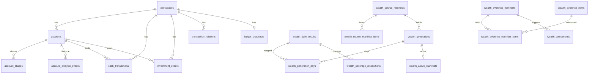

# Finance Tracker 数据库表结构文档（015 目标态）

> **文档性质**：本文件是 feature `015-inline-row-provenance` 的**目标 schema**（正式事实结构清理），由基线 `docs/database-schema.md`（head `20260724_07_fact_field_unify`）修订而来。  
> **实现落地前**：运行时权威仍是 `src/ft/adapters/relational/models.py` + 已应用的 Alembic 迁移。  
> **双后端**：PostgreSQL（生产）与文件型 SQLite（契约/本地）；逻辑 schema 共享。  
> **主键**：本文仍按 **UUID 字符串 PK** 描述（与基线一致）。`016-bigint-surrogate-ids` 若先/同波落地，仅 PK/FK 类型变为整数，**不**恢复已删作业表。

可执行行为与持久化合同以 constitution 与本 feature 的 `spec.md` 为准；本文是 015 完成后的**结构速查**。

### 相对基线的变更摘要（015）

| 动作 | 对象 |
|---|---|
| **删除表** | `import_batches`、`raw_files`、`raw_records`、`fact_deletion_events`、`record_revisions`、`relation_check_runs` |
| **保留表（明确）** | `ledger_snapshots`（派生缓存）；wealth 读模型族（结构不动，仅去 raw 依赖） |
| **删除列** | 事实/估值：`raw_record_id`；现金：`offset_*`（6）、`proposed_action`、`locked`、`transfer_account`、`source`、`bill_source`；投资：`price`（可由 legs 推导）；事实上仅服务未实现改账的 `revision`（若存在且无递增语义则删，见 spec FR-021） |
| **保留列（明确）** | **`record_id`**（行键）与 **`source_type`**（导入渠道名）组成幂等复合键；软删行字段 `deleted_at`/`deleted_by`/`delete_reason` |
| **新增/正式列** | 现金/投资：`source_type`（导入渠道名）、`source_payload`；投资业务行键正式列名统一为 **`record_id`**（不用平行 `source_identity`） |
| **新增约束** | 活跃幂等：`(workspace_id, source_type, record_id)` = workspace 内 **`record_id` × `source_type`**（见 §5） |
| **不再持久化** | 文件路径/digest/批次；行内 offset/locked/transfer_account/source/bill_source；投资 `price`；删除事件表；修订链；关系检查 run |

---

---

## 1. 总体架构

```
workspaces  (租户隔离根)
    │
    ├─ accounts
    │     ├─ account_aliases
    │     └─ account_lifecycle_events
    │
    ├─ cash_transactions     source_type / record_id / source_payload
    ├─ investment_events     source_type / record_id / source_payload + residual payload
    │
    ├─ transaction_relations
    ├─ ledger_snapshots          (派生缓存，非 SoT，**保留**)
    │
    └─ wealth_* 读模型族（本 feature 不砍表）
          valuation_observations
          wealth_source_manifests / items
          wealth_generations / generation_days / active_manifests
          wealth_daily_results
          wealth_coverage_dispositions
          wealth_components
          wealth_evidence_manifests / items / manifest_items
```

### 设计原则（摘要）

| 原则 | 说明 |
|---|---|
| Workspace 隔离 | 几乎所有业务表带 `workspace_id`；跨表 FK 多为复合 `(workspace_id, id)`，禁止跨 workspace 关联 |
| 正式事实 SoT | `cash_transactions` / `investment_events` 为账本事实；CSV/PDF **仅瞬时输入**，不落库为作业/文件表 |
| 行级幂等 | 账单行是否已入账只看活跃事实上的 **`record_id` × `source_type`**（`source_type`=导入渠道名） |
| 行级原始快照 | `source_payload` 与正式列同在事实行；供 relations hard-key / 排障；**不是**文件档案；渠道正式列为 `source_type` |
| 金额精度 | `ExactDecimal`：PG `NUMERIC(38,18)`；SQLite 无损文本；禁止 float |
| 时间 | `UTCDateTime`：一律 timezone-aware UTC |
| 逻辑删除 | 现金事实行上 `deleted_at`/`deleted_by`/`delete_reason`（无独立删除事件表）；删后再导同一 **`record_id` × `source_type`** 可新建活跃实例 |
| 修订审计 | **无** `record_revisions`；不持久化改账版本链；导入快照看 `source_payload` |

---

## 2. 公共类型与约定

### 2.1 自定义列类型

| 类型 | PostgreSQL | SQLite | 规则 |
|---|---|---|---|
| `ExactDecimal` | `NUMERIC(38,18)` | `String(96)` 十进制文本 | 有限 Decimal；PG 读后 strip 尾零 padding |
| `UTCDateTime` | `timestamptz` | aware `DateTime` | bind 必须带 tz；统一存 UTC |

### 2.2 主键形态（当前）

- 多数业务表：`String(36)` UUID
- 部分 wealth 读模型：调用方提供的确定性字符串 ID（`String(128/160)`）
- `workspaces.id`：`String(64)` 业务键（由配置 `FT_WORKSPACE_ID` 绑定）
- `ledger_snapshots` / `wealth_active_manifests`：以 `workspace_id` 为 PK（每 workspace 一行）

### 2.3 领域枚举（应用层约束，部分有 DB Check）

| 概念 | 取值 |
|---|---|
| 账户类型 `accounts.type` | `cash` / `loan` / `lend` / `security` / `crypto` |
| 现金分类（应用） | `income` / `expense` / `transfer` / `transfer_in` / `transfer_out` / `checkin` |
| 关系 kind | `payment_mirror` / `transfer_pair` / `refund_offset`（DB Check） |
| 关系 status | `pending_review` / `accepted` / `rejected` / `superseded`（DB Check） |
| 关系检查 run status | `pending` / `running` / `completed` / `failed`（DB Check） |
| 估值 identity_kind | `cash_account` / `position` / `instrument_quote` / `currency_pair` / `fx` |
| 币种 | 开放 3 字母码；展示常用 `CNY` / `USD` / `HKD` |

---

## 3. 核心租户与账户

### 3.1 `workspaces`

工作区（隔离边界）。

| 列 | 类型 | 空 | 说明 |
|---|---|---|---|
| `id` | String(64) **PK** | N | 工作区键 |
| `name` | String(255) | N | 显示名 |
| `created_at` | UTCDateTime | N | 创建时间 |

删除 workspace → 级联清理其下属行（视各 FK `ondelete`）。

### 3.2 `accounts`

账户主数据。多币种后：**账户名在 workspace 内唯一**；币种落在事实行上，账户本身无 `currency` 列。

| 列 | 类型 | 空 | 说明 |
|---|---|---|---|
| `id` | String(36) **PK** | N | UUID，默认生成 |
| `workspace_id` | String(64) FK→workspaces | N | `ON DELETE CASCADE` |
| `name` | String(255) | N | 显示名 |
| `type` | String(32) | N | 账户类型 |
| `active` | Boolean | N | 默认 true |
| `metadata_json` | JSON | N | 扩展元数据，默认 `{}` |
| `created_at` | UTCDateTime | N | |
| `updated_at` | UTCDateTime | N | onupdate |

**约束 / 索引**

- `uq_accounts_workspace_id`：`(workspace_id, id)` — 复合 FK 目标
- `uq_accounts_workspace_name`：`(workspace_id, name)`
- `ix_accounts_workspace`：`(workspace_id)`

有事实引用时账户 FK 多为 `RESTRICT`，空账户才可硬删。

### 3.3 `account_aliases`

账户别名（导入匹配、展示映射）。

| 列 | 类型 | 空 | 说明 |
|---|---|---|---|
| `id` | String(36) **PK** | N | |
| `workspace_id` | String(64) FK→workspaces | N | CASCADE |
| `alias_type` | String(32) | N | 别名类型 |
| `alias_value` | String(255) | N | 别名值 |
| `account_id` | String(36) | N | 复合 FK→accounts |
| `created_at` / `updated_at` | UTCDateTime | N | |

**约束 / 索引**

- `uq_account_aliases_workspace_id`：`(workspace_id, id)`
- `uq_account_aliases_value_account`：`(workspace_id, alias_type, alias_value, account_id)`
- `fk_account_aliases_workspace_account`：`(workspace_id, account_id)` → accounts，`CASCADE`
- `ix_account_aliases_workspace_value`：`(workspace_id, alias_type, alias_value)`

### 3.4 `account_lifecycle_events`

账户生命周期事件（开户/销户等，驱动 wealth 覆盖「不适用」）。

| 列 | 类型 | 空 | 说明 |
|---|---|---|---|
| `event_id` | String(128) **PK** | N | 确定性事件身份 |
| `workspace_id` | String(64) FK→workspaces | N | CASCADE |
| `account_id` | String(36) | N | 复合 FK→accounts，`RESTRICT` |
| `event_kind` | String(16) | N | 事件种类 |
| `effective_at` | UTCDateTime | N | 生效时刻 |
| `source_identity` | String(255) | N | 来源身份 |
| `source_revision` | String(128) | N | 来源修订 |
| `reason` | Text | N | 默认 `""` |
| `created_at` | UTCDateTime | N | |

**约束 / 索引**

- `uq_lifecycle_workspace_event`：`(workspace_id, event_id)`
- `ix_lifecycle_workspace_account_effective`：`(workspace_id, account_id, effective_at)`

---

## 4. 导入与文件（015：不持久化）

**015 删除**基线中的整条导入溯源链：

| 已删除表 | 原职责 | 替代 |
|---|---|---|
| `import_batches` | 导入作业壳、source_digest、status | **无**；文件仅为进程内瞬时输入 |
| `raw_files` | 文件路径/大小/media_type/digest | **无** |
| `raw_records` | 行 identity + payload + 幂等唯一 | **迁入** `cash_transactions` / `investment_events` 的 `source_*` 列 |

### 4.1 运行时导入语义（非表）

```
读文件（内存/临时文件）
  → parse
  → 每行 source_type + record_id + source_payload
  → 查活跃正式事实是否已占用 identity
  → novel → INSERT 正式事实（含 source_*）
  → 更新 snapshot
  → relations.check(seed_fact_ids=新建 id)
```

- **不**写入文件 digest / 路径 / batch 状态到数据库。  
- 幂等门禁：**仅**活跃事实的 **`record_id` × `source_type`**（导入渠道名 × 行键）。  
- CLI 可报告 `new_rows` / 成功消息；**无**持久化 `batch_id`。


---

## 5. 正式账本事实

### 5.1 `cash_transactions`

现金正式事实。账单派生行在同行携带 `source_type` / **`record_id`** / `source_payload`；**无** `raw_record_id`。

| 列 | 类型 | 空 | 说明 |
|---|---|---|---|
| `id` | String(36) **PK** | N | |
| `workspace_id` | String(64) FK→workspaces | N | CASCADE |
| `account_id` | String(36) | N | 复合 FK→accounts `RESTRICT` |
| `source_type` | String(64) | Y | **导入渠道名**（幂等复合键的一半；如 alipay/wechat/券商 kind）；手工可空 |
| `record_id` | String(512) | Y* | **业务行键**（平台流水/展示号或确定性内容键）；与 `source_type` 组成幂等；账单派生应非空；手工可空。空串视为「无身份」（见约束） |
| `source_payload` | JSON | Y | 行级原始快照（匹配/排障；可含原 payment 文案等）；手工可空 |
| `occurred_at` | UTCDateTime | N | 发生时刻（UTC） |
| `amount` | ExactDecimal | N | 有符号金额 |
| `currency` | String(3) | N | 币种 |
| `counterparty` | String(512) | N | 对手方 |
| `note` | Text | N | 备注 |
| `category` | String(64) | N | 分类（含 transfer / transfer_in / transfer_out 等） |
| `created_at` | UTCDateTime | N | |
| `deleted_at` | UTCDateTime | Y | 逻辑删除时间 |
| `deleted_by` | String(128) | N | 删除操作者（行内审计；无独立删除事件表） |
| `delete_reason` | Text | N | 删除原因 |

\* 应用层：空 `record_id` 或空 `source_type` 表示无完整业务身份（手工）；**二者皆非空**才参与幂等。

**约束 / 索引**

- `uq_cash_transactions_workspace_id`：`(workspace_id, id)`
- **部分唯一** `uq_cash_transactions_active_source_record`（PG/SQLite partial）：  
  `(workspace_id, source_type, record_id)`  
  **WHERE** `source_type IS NOT NULL AND source_type <> '' AND record_id IS NOT NULL AND record_id <> '' AND deleted_at IS NULL`  
  → 活跃账单行按 **`record_id` × `source_type`** 不双记；逻辑删除后同一复合身份可再入账为新行；跨渠道相同 `record_id` 字面不冲突
- `ix_cash_transactions_workspace_date`：`(workspace_id, occurred_at)`
- `ix_cash_transactions_workspace_account`：`(workspace_id, account_id)`
- `ix_cash_transactions_workspace_source_record`：`(workspace_id, source_type, record_id)`（查询/幂等查找）

**规则**

- 账单派生：`source_type`（导入渠道名）、`record_id`、`source_payload` 均应非空（应用层强制）。
- 手工事实：身份相关字段可空；不占用 partial unique。
- 幂等比较单位永远是 **`(source_type, record_id)`**，不是裸 `record_id`。
- `source_payload` 至少覆盖 relations hard-key / 日期几何所需键；允许瘦身，不得丢匹配字段。
- **015 删除**列：`raw_record_id`、`offset_*`、`proposed_action`、`locked`、`transfer_account`、`source`、`bill_source`、以及无改账语义时的 `revision`。核销/转账权威在 `transaction_relations` + 正式 `category`。

### 5.2 `investment_events`

投资正式事实（证券/加密等）。核心 leg 已提升为列（014）；`payload` 保留非核心扩展。

| 列 | 类型 | 空 | 说明 |
|---|---|---|---|
| `id` | String(36) **PK** | N | |
| `workspace_id` | String(64) FK→workspaces | N | CASCADE |
| `account_id` | String(36) | N | → accounts `RESTRICT` |
| `source_type` | String(64) | Y | **导入渠道名**（幂等复合键一半；券商/解析 kind）；手工可空 |
| `record_id` | String(512) | Y | **业务行键**（与 `source_type` 组成幂等；与现金目录同名；不用平行 source_identity） |
| `source_payload` | JSON | Y | 导入解析行快照（可瘦身）；与 residual `payload` 分工见下 |
| `occurred_at` | UTCDateTime | N | |
| `action` | String(64) | N | 原 `kind`；如 swap/deposit/withdraw/dividend/fee/ipo 等 |
| `currency` | String(3) | N | 默认 `""` |
| `note` | Text | N | |
| `from_ticker` | String(64) | N | 支出腿标的 |
| `from_amount` | ExactDecimal | Y | 支出数量/金额 |
| `to_ticker` | String(64) | N | 收入腿标的 |
| `to_amount` | ExactDecimal | Y | 收入数量/金额 |
| `commission` | ExactDecimal | Y | 佣金/费用 |
| `commission_asset` | String(64) | N | 费用币种/资产 |
| `payload` | JSON | N | **业务 residual**（014 后非 core 扩展）；非文件溯源 |
| `created_at` | UTCDateTime | N | |

**约束 / 索引**

- `uq_investment_events_workspace_id`：`(workspace_id, id)`
- **唯一（投资当前无逻辑删除）** `uq_investment_events_source_record`：  
  `(workspace_id, source_type, record_id)` **WHERE** `source_type IS NOT NULL AND source_type <> '' AND record_id IS NOT NULL AND record_id <> ''`  
  → **`record_id` × `source_type`**；跨渠道同号不冲突  
  （若未来支持删除语义，改为与现金相同的 partial + 删除标记）
- `ix_investment_events_workspace_date` / `ix_investment_events_workspace_account`
- `ix_investment_events_workspace_source_record`：`(workspace_id, source_type, record_id)`

**015 删除**正式列 `price`：成交单价由 legs（数量/现金金额）及既有 commission 规则派生，不落库、不回灌 residual `payload`。

**`source_payload` vs `payload`**

| 字段 | 用途 |
|---|---|
| `source_payload` | 导入时解析行快照；幂等/排障/若匹配需原始券商字段 |
| `payload` | 正式事件 residual（非 core 业务扩展），014 语义不变 |

### 5.3 ~~`record_revisions`~~

> **015 已删除**：不持久化改账版本链。

### 5.4 ~~`fact_deletion_events`~~

> **015 已删除**：逻辑删除审计仅在事实行 `deleted_at` / `deleted_by` / `delete_reason`。

### 5.5 `ledger_snapshots`

从正式事实派生的账本投影缓存（**非事实源**）。

| 列 | 类型 | 空 | 说明 |
|---|---|---|---|
| `workspace_id` | String(64) **PK** FK→workspaces | N | CASCADE；每 workspace 一行 |
| `payload` | JSON | N | 以 account_id 为 key 的 bucket |
| `version` | Integer | N | 默认 1 |
| `updated_at` | UTCDateTime | N | |

---

## 6. 交易关系（对账 / 镜像 / 退款 / 转账）

### 6.1 `transaction_relations`

| 列 | 类型 | 空 | 说明 |
|---|---|---|---|
| `id` | String(36) **PK** | N | |
| `workspace_id` | String(64) FK→workspaces | N | CASCADE |
| `kind` | String(32) | N | `payment_mirror` / `transfer_pair` / `refund_offset` |
| `subtype` | String(64) | N | 如 credit_repayment；可空串 |
| `primary_fact_id` | String(36) | N | 角色化主键腿 |
| `secondary_fact_id` | String(36) | Y | 对侧腿；open-leg 可空 |
| `primary_fact_type` | String(32) | N | 默认 `cash` |
| `secondary_fact_type` | String(32) | Y | |
| `ordered_fact_a` | String(36) | N | 排序后业务键 A |
| `ordered_fact_b` | String(36) | N | B；open-leg 用空串哨兵 |
| `active_slot` | String(36) | N | 活跃占位；默认 `active`；superseded 用 id 释放键 |
| `status` | String(32) | N | pending_review / accepted / rejected / superseded |
| `rule_id` | String(128) | N | 匹配规则 |
| `confidence` | String(32) | N | |
| `evidence_json` | JSON | N | 证据 |
| `created_by` | String(128) | N | 默认 `system` |
| `created_at` | UTCDateTime | N | |
| `decided_by` | String(128) | N | |
| `decided_at` | UTCDateTime | Y | |
| `decision_reason` | Text | N | |
| `later_marker` | String(64) | N | |
| `superseded_by_id` | String(36) | Y | 被谁替代 |
| `revision` | Integer | N | 默认 1 |
| `anchor_fact_id` | String(36) | N | open-leg / 角色锚点 |

**关键约束**

- `uq_transaction_relations_workspace_id`
- `uq_transaction_relations_active_business_key`：  
  `(workspace_id, kind, ordered_fact_a, ordered_fact_b, subtype, active_slot)`
- 部分唯一索引 `uq_transaction_relations_open_leg_active`（PG/SQLite partial）：  
  active open-leg 占位 `(workspace_id, kind, subtype, anchor_fact_id)` where `secondary_fact_id IS NULL AND active_slot='active'`
- Checks：
  - kind / status 枚举
  - accepted 必须 bilateral（`secondary_fact_id NOT NULL`）
  - payment_mirror 必须 bilateral
  - open-leg 仅允许 refund_offset/transfer_pair 且 status 非 accepted

**索引**：status、kind、primary、secondary、anchor

> 注意：`transaction_relations` 的 fact 引用是**逻辑引用**（字符串 fact id），模型层**没有**到 `cash_transactions` / `investment_events` 的外键；匹配引擎在应用层保证 active 语义。

### 6.2 ~~`relation_check_runs`~~

> **015 已删除**：关系检查作业壳不落库；SoT 为 `transaction_relations`。

## 7. Wealth 归因读模型

> 身份多为**确定性内容键**（非随机 UUID），便于幂等重建。金额用 `ExactDecimal` 或 canonical 文本。

### 7.1 `valuation_observations`

估值观测（现金余额、持仓、行情、FX）。

| 列 | 类型 | 空 | 说明 |
|---|---|---|---|
| `observation_id` | String(128) **PK** | N | |
| `workspace_id` | String(64) FK→workspaces | N | CASCADE |
| `identity_kind` | String(32) | N | cash_account / position / instrument_quote / currency_pair / fx |
| `identity` | String(255) | N | 稳定身份；现金为 `{account_id}:{currency}` |
| `owner_account_id` | String(36) | Y | 账户持有类必填；报价/FX 为空。复合 FK→accounts `RESTRICT` |
| `observation_kind` | String(32) | N | boundary_checkin / quantity_checkin / quote / fx 等 |
| `value` | ExactDecimal | N | |
| `currency` | String(3) | N | |
| `unit` | String(32) | N | |
| `as_of` | UTCDateTime | N | 适用时刻 |
| `observed_at` | UTCDateTime | N | 观测/发布时间 |
| `source_identity` | String(255) | N | 观测来源身份（非导入文件表） |
| `source_revision` | String(128) | N | 修正追加新 revision，不原地改 |
| `trust` | String(32) | N | trusted_checkin / trusted_provider 等 |
| `created_at` | UTCDateTime | N | 不参与财务身份 |

**约束**

- `uq_valuation_revision`：`(workspace_id, observation_id, source_revision)`
- `ck_valuation_owner_kind`：owner 与 identity_kind 一致性
- `ck_valuation_cash_owner_identity`：现金 identity 必须以 `owner_account_id:` 为前缀
- `ix_valuation_workspace_identity_asof`

015：**删除**可选列 `raw_record_id`（原弱链到已移除的 `raw_records`）；wealth 主路径不依赖导入 raw 表。

### 7.2 Source Manifest 族

#### `wealth_source_manifests`

| 列 | 类型 | 空 | 说明 |
|---|---|---|---|
| `manifest_id` | String(128) **PK** | N | |
| `workspace_id` | String(64) FK→workspaces | N | CASCADE |
| `source_watermark` | String(128) | N | |
| `canonical_digest` | String(128) | N | |
| `created_at` | UTCDateTime | N | |

- `uq_source_manifest_workspace_id`：`(workspace_id, manifest_id)`

#### `wealth_source_manifest_items`

| 列 | 类型 | 空 | 说明 |
|---|---|---|---|
| `id` | String(128) **PK** | N | |
| `workspace_id` | String(64) | N | |
| `manifest_id` | String(128) | N | FK→manifests（单列 + 复合） |
| `item_kind` | String(32) | N | |
| `item_identity` | String(255) | N | |
| `revision` | String(128) | N | |
| `content_digest` | String(128) | N | |
| `evidence_occurred_at` | UTCDateTime | Y | |
| `evidence_kind` | String(64) | Y | |
| `evidence_contribution` | ExactDecimal | Y | |
| `evidence_scope_fold_identity` | String(255) | Y | |
| `evidence_safe_metadata` | Text | N | 默认 `"{}"` |

- `uq_manifest_item`：`(workspace_id, manifest_id, item_identity, revision)`

### 7.3 Generation / 日结果

#### `wealth_generations`

| 列 | 类型 | 空 | 说明 |
|---|---|---|---|
| `build_revision` | String(128) **PK** | N | |
| `workspace_id` | String(64) FK→workspaces | N | CASCADE |
| `source_watermark` | String(128) | N | |
| `source_manifest_id` | String(128) | N | 复合 FK→source manifests `RESTRICT` |
| `calculation_version` | String(64) | N | |
| `valuation_policy_version` | String(64) | N | |
| `date_from` / `date_to` | String(10) | N | 本地日期 `YYYY-MM-DD` |
| `expected_active_revision` | String(128) | Y | |
| `state` | String(16) | N | 构建状态 |
| `canonical_manifest_digest` | String(128) | N | |
| `created_at` | UTCDateTime | N | |
| `completed_at` | UTCDateTime | Y | |

- `uq_generation_workspace_build`：`(workspace_id, build_revision)`

#### `wealth_daily_results`

| 列 | 类型 | 空 | 说明 |
|---|---|---|---|
| `result_digest` | String(128) **PK** | N | 内容寻址 |
| `workspace_id` | String(64) FK→workspaces | N | CASCADE |
| `local_date` | String(10) | N | |
| `calculation_version` | String(64) | N | |
| `valuation_policy_version` | String(64) | N | |
| `source_revision` | String(128) | N | |
| `result_revision` | String(128) | N | |
| `canonical_payload` | Text | N | 规范化结果正文 |
| `created_at` | UTCDateTime | N | |

- `uq_daily_result_workspace_digest`：`(workspace_id, result_digest)`

#### `wealth_generation_days`

| 列 | 类型 | 空 | 说明 |
|---|---|---|---|
| `id` | String(160) **PK** | N | |
| `workspace_id` | String(64) | N | |
| `build_revision` | String(128) | N | → generations `CASCADE` |
| `local_date` | String(10) | N | |
| `result_digest` | String(128) | Y | → daily_results `RESTRICT` |
| `missing_reason` | String(64) | Y | 缺日原因 |

- `uq_generation_day`：`(workspace_id, build_revision, local_date)`

#### `wealth_active_manifests`

当前激活的 generation（每 workspace 一行）。

| 列 | 类型 | 空 | 说明 |
|---|---|---|---|
| `workspace_id` | String(64) **PK** FK→workspaces | N | CASCADE |
| `build_revision` | String(128) | N | 复合 FK→generations `RESTRICT` |
| `manifest_revision` | Integer | N | |
| `updated_at` | UTCDateTime | N | |

### 7.4 Evidence / Component / Coverage

#### `wealth_evidence_items`

| 列 | 类型 | 空 | 说明 |
|---|---|---|---|
| `evidence_identity` | String(128) **PK** | N | |
| `workspace_id` | String(64) FK→workspaces | N | CASCADE |
| `source_identity` | String(255) | N | |
| `source_revision` | String(128) | N | |
| `occurred_at` | UTCDateTime | N | |
| `evidence_kind` | String(64) | N | |
| `contribution` | ExactDecimal | Y | |
| `safe_metadata` | Text | N | 默认 `"{}"` |

- `uq_evidence_item_workspace_id`：`(workspace_id, evidence_identity)`

#### `wealth_evidence_manifests`

| 列 | 类型 | 空 | 说明 |
|---|---|---|---|
| `manifest_id` | String(128) **PK** | N | |
| `workspace_id` | String(64) FK→workspaces | N | CASCADE |
| `result_revision` | String(128) | N | |
| `ordering_version` | String(32) | N | |
| `canonical_digest` | String(128) | N | |
| `source_manifest_id` | String(128) | Y | → source manifests `RESTRICT` |
| `selection_payload` | Text | N | 默认 `"{}"` |

#### `wealth_evidence_manifest_items`

| 列 | 类型 | 空 | 说明 |
|---|---|---|---|
| `id` | String(160) **PK** | N | |
| `workspace_id` | String(64) | N | |
| `manifest_id` | String(128) | N | → evidence manifests `CASCADE` |
| `evidence_identity` | String(128) | N | → evidence items `RESTRICT` |
| `scope_fold_identity` | String(255) | N | |
| `contribution` | ExactDecimal | Y | |

- `uq_evidence_fold`：`(workspace_id, manifest_id, scope_fold_identity)`

#### `wealth_components`

归因分量（external_cashflow / investment_return / fx_impact …）。

| 列 | 类型 | 空 | 说明 |
|---|---|---|---|
| `component_id` | String(128) **PK** | N | |
| `workspace_id` | String(64) FK→workspaces | N | CASCADE |
| `component_key` | String(128) | N | |
| `result_revision` | String(128) | N | |
| `kind` | String(64) | N | 分量种类 |
| `status` | String(16) | N | complete/stale/partial/unsupported 等 |
| `amount` | ExactDecimal | Y | |
| `evidence_manifest_id` | String(128) | N | → evidence manifests `RESTRICT` |
| `canonical_payload` | Text | N | |

#### `wealth_coverage_dispositions`

某日结果下各 owned identity 的覆盖处置。

| 列 | 类型 | 空 | 说明 |
|---|---|---|---|
| `id` | String(160) **PK** | N | |
| `workspace_id` | String(64) | N | |
| `result_digest` | String(128) | N | → daily_results `CASCADE` |
| `local_date` | String(10) | N | |
| `source_revision` | String(128) | N | |
| `owner_account_id` | String(36) | N | → accounts `RESTRICT` |
| `identity_kind` | String(32) | N | |
| `identity` | String(255) | N | |
| `disposition` | String(32) | N | supported/missing/unsupported/unvalued/not_applicable |

- `uq_coverage_result_owned_identity`：  
  `(workspace_id, result_digest, owner_account_id, identity_kind, identity)`

---

## 8. 表清单速查（共 23 张）

| # | 表名 | 职责 |
|---|---|---|
| 1 | `workspaces` | 租户根 |
| 2 | `accounts` | 账户 |
| 3 | `account_aliases` | 账户别名 |
| 4 | `account_lifecycle_events` | 账户生命周期 |
| 5 | `cash_transactions` | 现金事实 + 内联行级溯源 |
| 6 | `investment_events` | 投资事实 + 内联行级溯源 |
| 7 | `ledger_snapshots` | 派生快照缓存（**保留**） |
| 10 | `transaction_relations` | 交易关系 |
| 12 | `valuation_observations` | 估值观测 |
| 13 | `wealth_source_manifests` | 源清单 |
| 14 | `wealth_source_manifest_items` | 源清单项 |
| 15 | `wealth_generations` | 财富构建世代 |
| 16 | `wealth_generation_days` | 世代×日映射 |
| 17 | `wealth_daily_results` | 日结果（内容寻址） |
| 18 | `wealth_active_manifests` | 激活世代指针 |
| 19 | `wealth_components` | 归因分量 |
| 20 | `wealth_evidence_manifests` | 证据清单 |
| 21 | `wealth_evidence_items` | 证据项 |
| 22 | `wealth_evidence_manifest_items` | 证据清单链接 |
| 23 | `wealth_coverage_dispositions` | 覆盖处置 |

**已删除（相对基线）**：`import_batches`、`raw_files`、`raw_records`、`fact_deletion_events`、`record_revisions`、`relation_check_runs`。

---

## 9. 关键关系（逻辑 ER）

```
workspaces 1──* accounts 1──* account_aliases
                 │         └──* account_lifecycle_events
                 │
                 ├──* cash_transactions   （含 source_type / record_id / source_payload）
                 ├──* investment_events   （同上）
                 │
                 ├──* transaction_relations (facts by id, no DB FK to facts)
                 ├──1 ledger_snapshots
                 │
                 └── wealth 读模型（manifest → generation → daily_result → coverage/component/evidence）
```



---

## 10. 迁移历史（Alembic）

| Revision | 文件 | 内容 |
|---|---|---|
| `20260717_01` | `..._initial.py` | 初始：workspace/account/import/raw/cash/investment/snapshot/revisions |
| `20260719_02` | `..._wealth_attribution.py` | wealth 归因读模型表族 |
| `20260720_03` | `..._import_batch_multi_account.py` | 导入批次多账户（target 可空等） |
| `20260720_04` | `..._multi_currency_accounts.py` | 账户去 currency 列；同名合并；name 唯一 |
| `20260721_05` | `..._transaction_relations.py` | relations / check_runs / aliases / deletion_events |
| `20260722_06` | `..._open_leg_pending.py` | open-leg：`anchor_fact_id`、partial unique、checks |
| `20260724_07` | `..._fact_field_unify.py` | cash `description`→`note`；investment `kind`→`action`；leg 列提升 |
| **015（计划）** | *待实现* | fact 增 `source_*`；回填自 raw；drop `raw_record_id` 与 `import_batches`/`raw_files`/`raw_records`；valuation 去 `raw_record_id` |

升级：

```bash
export FT_DATABASE_URL='postgresql+psycopg://...'
# 或 sqlite+pysqlite:////path/to.db
uv run alembic upgrade head
```

---

## 11. 运行时与方言差异

| 项 | PostgreSQL | SQLite |
|---|---|---|
| 金额 | `NUMERIC(38,18)` | 文本 Decimal |
| 时间 | timestamptz | aware DateTime，读回补 UTC |
| JSON | 原生 JSON | JSON affinity |
| 引擎 | `pool_pre_ping=True` | WAL、`foreign_keys=ON`、busy_timeout 5s |
| 选择 | `FT_DATABASE_URL` **显式**指定；无自动回退、无双写 | 同左 |
| 建表 | CLI **不**自动 migrate；需 `alembic upgrade head` | 同左 |

---

## 12. 相关在途 feature

### 016 bigint surrogate ids

- 范围内表 PK/FK 改为整数代理键（PG `BIGINT` / SQLite `INTEGER`）
- **对外/幂等**仍用稳定复合业务键：事实行上的 **`record_id` × `source_type`（导入渠道名）**（**不再**依赖 raw 表或文件 digest）
- 与 016（bigint）正交；合并迁移时可一次完成 PK 改写 + 溯源内联

### 015 inline row provenance（本文）

- 删除导入作业/文件/独立 raw 表；删除 fact_deletion_events / record_revisions / relation_check_runs；现金列清理；幂等键为 **record_id × source_type（导入渠道名）**
- 行级溯源内联到正式事实；删除投资 `price`
- **交付任务**：代码就绪后**一次性**升级本机 **`~/.ft`** 下 SQLite 账本（默认 `~/.ft/finance-tracker.db`）：先备份 → 设置 `FT_DATABASE_URL` 指向该文件 → `alembic upgrade head`（或项目封装入口）→ 按 `spec.md` SC-012 验证；失败则从备份恢复。不迁移 `~/.ft` 内 mapping/bills 等非 db 文件。

---

## 13. 文档与代码索引

| 资源 | 路径 |
|---|---|
| 本目标 schema | `specs/015-inline-row-provenance/database-schema.md` |
| 规格 | `specs/015-inline-row-provenance/spec.md` |
| 实现前基线速查 | `docs/database-schema.md` |
| ORM 模型（落地后权威） | `src/ft/adapters/relational/models.py` |
| 方言/引擎 | `src/ft/adapters/relational/dialect.py` |
| Alembic env | `migrations/env.py` |
| 领域常量（非表） | `src/ft/schema.py` |
| 产品 README | `README.md` |
