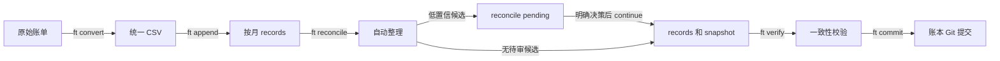
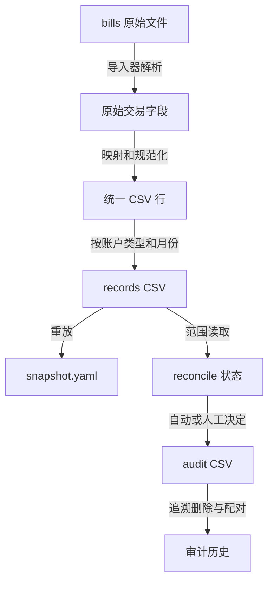
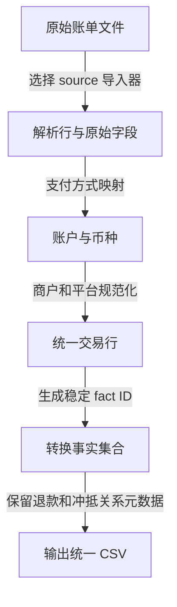
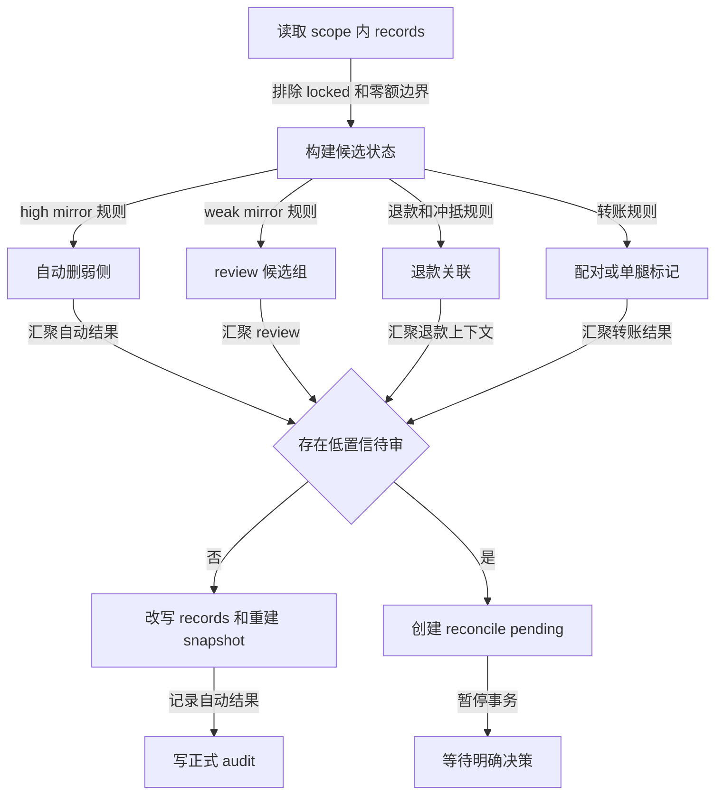
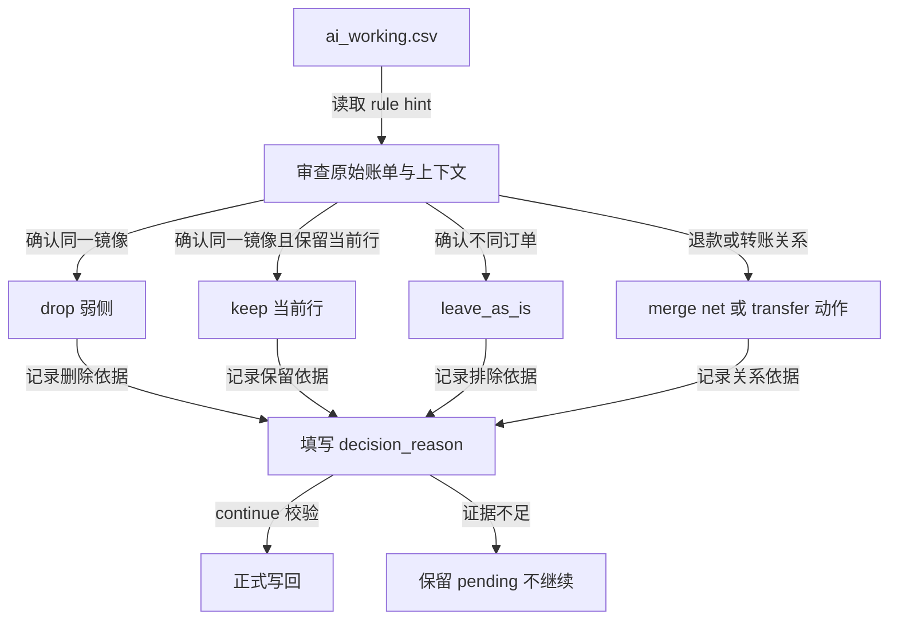
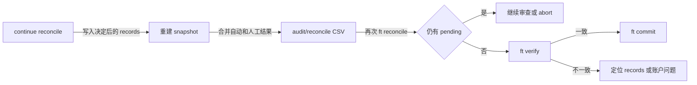

# 账单导入与 Reconcile 全流程

本文描述当前 `finance-tracker` 将原始账单导入 `.ft` 账本、识别重复与转账、生成审计并完成 Git 提交的实际流程。它覆盖现金类账单；证券账单有独立的导入路径。

## 1. 全景

账本采用双层存储：`records/<type>/<YYYY-MM>.csv` 保存可审计事实，`snapshot.yaml` 是由 records 重建的查询快照。原始账单永远不直接覆盖 records，所有变化都经过统一 CSV、校验和 reconcile。



正常运行时使用项目环境而不是假设全局命令可用：

```bash
cd /path/to/finance-tracker
FT_DIR=/path/to/.ft uv run ft convert ...
FT_DIR=/path/to/.ft uv run ft append ...
FT_DIR=/path/to/.ft uv run ft reconcile
```

`FT_DIR` 指向账本仓库；代码仓库与账本仓库可以独立演进。`convert`、`append`、`reconcile` 的写操作会 stage 账本改动，但只有 `ft commit` 才创建账本提交。

## 2. 核心数据与职责



| 位置 | 责任 |
| --- | --- |
| `bills/` | 原始输入，只读存档。 |
| `mapping.yaml` | 将账单支付方式映射到已登记账户。 |
| `accounts.yaml` | 账户名称、类型、币种、启用状态。 |
| `records/cash`、`records/loan` | 按月的正式现金、负债事实记录。 |
| `snapshot.yaml` | records 重放得到的余额/持仓快照。 |
| `pending/` | 可暂停事务的隔离工作区，不是正式账本。 |
| `audit/reconcile` | 去重、转账、人工删除等可追溯审计结果。 |

正式 records 的 `record_id` 是事实主键。reconcile 的工作 CSV 另有会话展示用的 `record_id`（如 `r_000001`），并通过只读的 `source_record_id` 指回正式事实 ID；写回和删除均以 `source_record_id` 为准。

## 3. Convert：账单变为统一 CSV

`ft convert <file> --source <source> --output <out.csv>` 选择对应导入器，例如支付宝、微信、工行信用卡/借记卡、建行借记卡。PDF 账单可额外传入密码。



### Convert 的主要工作

1. 解析账单格式，保留原始交易对方、描述和支付方式。
2. 依据 `mapping.yaml` 匹配账户，校验账户存在且币种一致。
3. 规范化 `counterparty`、`description`、`source` 与分类；原始字段仍被保存以便追溯。
4. 生成稳定事实 ID。ID 的输入必须能区分同日、同额、同商户的多笔真实交易；例如建行借记卡会纳入交易后余额，避免事实碰撞。
5. 对退款、冲抵保留事实，并写入强弱、关联方向和建议动作等元数据；跨来源或低置信判断留给 reconcile。

convert 当前不会创建 pending，会直接输出统一 CSV；它不删退款事实，也不对跨来源重复作最终决定。

## 4. Append：统一 CSV 按月落盘

`ft append <converted-1.csv> <converted-2.csv> ...` 在写入前读取所有输入并校验。它按账户类型与交易月份归档为 `records/<type>/<YYYY-MM>.csv`，将既有行与输入行合并、排序后落盘。


append 不负责事实去重或跨来源镜像去重。convert 在构建单份账单的事实集合时使用稳定事实 ID 排除同一输入中的重复行；微信/支付宝账单与银行卡账单之间的镜像仍应被保留到 records，交由 reconcile 在拥有完整上下文时处理。

## 5. Reconcile：自动规则与待审门禁

`ft reconcile` 可处理全量、单月或日期范围。它先读取 scope 内 records，保留 `locked=1` 的人工锁定事实，并生成一份 reconciliation state。



### 自动判定

reconcile 的自动结果包括：

- 高置信镜像：同账户、同金额、同币种、时间满足渠道窗口，且一侧是具体商户/服务、另一侧是银行卡通道化文本时，只删除弱侧。
- 明确退款/冲抵：按既有退款规则净额化或关联。
- 明确转账：标记两侧 `transfer_out`/`transfer_in`；无法配对但信号明确时可标记单腿转账。

自动规则不会升级以下高风险场景：退款链、社交流/红包/群收款/转账、建行仅日期记录、多候选、双方文本都泛化或锁定记录。

### Reconcile pending 的内容

当存在 review 候选时，程序创建：

```text
pending/reconcile/<session_id>/
├── manifest.json
├── status.json
├── ai_working.csv
├── staged_records/
└── proposed_audit.csv
```

`ai_working.csv` 提供候选及必要上下文，包含退款关联行和已经自动删除的行。自动删除行以 `row_status=dropped` 显示，便于审查整条链路，但不会在 continue 时被恢复。

## 6. Reconcile Pending 决策语义



字段分工：

- `ai_reason`：程序预填的规则建议，例如弱侧建议 `drop`、强侧建议 `keep`；它不是审查结论。
- `decision_reason`：审查者写入的证据和结论。带 `ai_group` 的 active 行选择 `keep` 或 `leave_as_is` 时必须填写；`drop`、`modify`、退款合并和转账动作同样必须填写。
- `ai_action`：`keep`、`leave_as_is`、`drop`、`modify`，或退款/转账的引用动作。
- `row_status`：描述工作行状态；自动删除行通常是 `dropped`。

`leave_as_is` 的含义是“已明确确认它不是需要处理的同一笔订单”，不能用来表示“暂时不确定”。证据不足时必须保持 pending，而不是调用 continue。

continue 时会校验行数、会话 ID、只读事实字段、双边转账关系和每个决策理由。它只替换 pending 涉及的真实 `source_record_id`，保留同一月文件中未触及的其他记录，随后重建 snapshot，并将自动审计与人工审计合并写入正式 audit。

## 7. 完成、校验与提交



完成条件：

1. 再次运行同一 scope 的 reconcile 不产生 pending。
2. `ft verify` 通过：cash/loan/lend 的账户引用有效，security 记录可重放且与快照一致。
3. audit 同时包含自动去重、转账处理和人工决策，能够解释每次删除或配对。
4. 确认无误后再执行 `ft commit`，将本次账本导入作为一个 Git 提交固定下来。

## 8. 操作检查表

```bash
# 1. 转换每份原始账单
FT_DIR=/path/to/.ft uv run ft convert bill.xlsx --source wechat --output /tmp/wechat.csv

# 2. 统一追加
FT_DIR=/path/to/.ft uv run ft append /tmp/wechat.csv /tmp/alipay.csv /tmp/bank.csv

# 3. 自动整理；若进入 pending，逐行明确填写 decision_reason
FT_DIR=/path/to/.ft uv run ft reconcile
FT_DIR=/path/to/.ft uv run ft reconcile --continue-with-decisions \
  /path/to/.ft/pending/reconcile/<session_id>/edited.csv

# 4. 验证幂等性和一致性
FT_DIR=/path/to/.ft uv run ft reconcile
FT_DIR=/path/to/.ft uv run ft verify

# 5. 确认后提交账本
FT_DIR=/path/to/.ft uv run ft commit -m "导入 2026-07 账单"
```

对于临时验证环境，最后一步可以省略；不要提交只用于验证的账本变更。
