# 账单导入与 Reconcile 全流程

本文描述当前 `finance-tracker` 将原始账单导入 `.ft` 账本、识别重复与转账、生成审计并完成 Git 提交的实际流程。它覆盖现金类账单；证券账单有独立的导入路径。

## 1. 全景

账本采用双层存储：`records/<type>/<YYYY-MM>.csv` 保存可审计事实，`snapshot.yaml` 是由 records 重建的查询快照。原始账单永远不直接覆盖 records，所有变化都经过统一 CSV、校验和 reconcile。

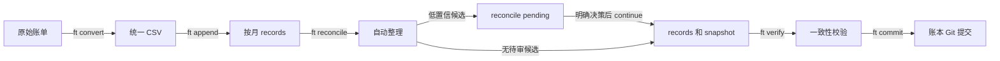

正常运行时使用项目环境而不是假设全局命令可用：

```bash
cd /path/to/finance-tracker
FT_DIR=/path/to/.ft uv run ft convert ...
FT_DIR=/path/to/.ft uv run ft append ...
FT_DIR=/path/to/.ft uv run ft reconcile
```

`FT_DIR` 指向账本仓库；代码仓库与账本仓库可以独立演进。`convert`、`append`、`reconcile` 的写操作会 stage 账本改动，但只有 `ft commit` 才创建账本提交。

## 2. 核心数据与职责

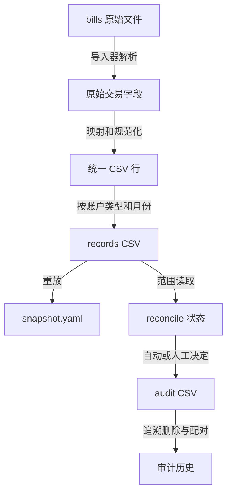

| 位置 | 责任 |
| --- | --- |
| `bills/` | 原始输入，只读存档。 |
| `mapping.yaml` | 将账单支付方式映射到已登记账户。 |
| `accounts.yaml` | 账户名称、类型、币种、启用状态。 |
| `records/cash`、`records/loan` | 按月的正式现金、负债事实记录。 |
| `snapshot.yaml` | records 重放得到的余额/持仓快照。 |
| `pending/` | 可暂停事务的隔离工作区，不是正式账本。 |
| `audit/reconcile` | 去重、转账、人工删除等可追溯审计结果。 |

正式 records 的 `record_id` 是事实主键。reconcile 的工作 CSV 直接使用该 ID；写回、删除和引用型 `decision_action` 都以它为准。会话 ID 只存在于 pending 目录及其 `manifest.json`、`status.json`，不重复写入 CSV。

### 产物字段总览

不同阶段使用不同 schema，不能把 convert 的关系建议、reconcile 的审查决定或 audit 的结果字段写回正式 records：

| 产物 | 位置 | 用途 | 写入者 |
| --- | --- | --- | --- |
| 统一 CSV | convert 的 `-o <file>` | 待 append 的标准化导入事实 | convert |
| 正式 records | `records/<type>/<YYYY-MM>.csv` | 账本事实源 | append / reconcile |
| 快照 | `snapshot.yaml` | 从 records 重建的余额视图 | append / reconcile / verify --fix |
| 审查底稿 | `pending/reconcile/<id>/ai_working.csv` | 系统提示与审查决定 | reconcile + 审查者 |
| 审计 | `audit/reconcile/<run_at>.csv` | 去重、转账、人工删除的追溯证据 | reconcile |

## 3. Convert：账单变为统一 CSV

`ft convert <file> --source <source> --output <out.csv>` 选择对应导入器，例如支付宝、微信、工行信用卡/借记卡、建行借记卡。PDF 账单可额外传入密码。

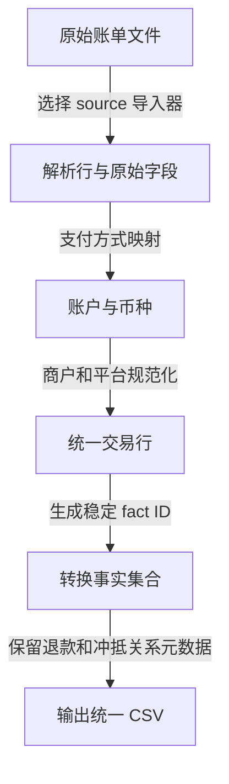

### Convert 的主要工作

1. 解析账单格式，保留原始交易对方、描述和支付方式。
2. 依据 `mapping.yaml` 匹配账户，校验账户存在且币种一致。
3. 规范化 `counterparty`、`description`、`source` 与分类，并输出统一字段。
4. 生成稳定事实 ID。ID 的输入必须能区分同日、同额、同商户的多笔真实交易；例如建行借记卡会纳入交易后余额，避免事实碰撞。
5. 对退款、冲抵保留事实，并写入强弱、关联方向和建议动作等元数据；跨来源或低置信判断留给 reconcile。

convert 当前不会创建 pending，会直接输出统一 CSV；它不删退款事实，也不对跨来源重复作最终决定。

### Convert 分类型流程

`ft convert` 的 source 不是简单的文件扩展名判断，而是选择对应的解析器和事实识别规则。所有类型最终都走相同的规范化、账户映射和统一 CSV 输出；区别在于原始字段、退款线索和稳定事实 ID 的来源。

| `--source` | 原始输入 | 主键与时间 | 账户和 source 路由 | 退款线索 |
| --- | --- | --- | --- | --- |
| `alipay` | 支付宝 CSV | 支付宝交易号；通常有秒级时间 | 支付宝支付方式映射到账户；`source=支付宝` | 交易状态、收支方向和“退款”描述；可使用订单文本关联原消费 |
| `wechat` | 微信 XLSX | 微信交易单号；通常有秒级时间 | 微信支付方式映射到账户；`source=微信` | 交易状态、设备号、美团订单号、收银台号、描述 token、品牌别名等线索 |
| `icbc` | 工行 PDF，需密码 | 解析后的交易字段哈希；自动识别信用卡或借记卡 | 信用卡可按卡号尾号和支付渠道路由；借记卡按映射账户路由 | 信用卡“退货/退款”等冲抵文本，或借记卡入账退款线索；会检查商户与账户簇的一致性 |
| `icbc-debit` | 工行借记卡表格账单，需密码 | 交易字段哈希 | 借记卡账户；`source=银行卡` 或从通道文本推断 | 入账退款、支付宝/微信等支付通道簇 |
| `ccb-debit` | 建行借记卡 XLS | 交易字段、日期和余额等组合生成稳定 ID；账单通常只有日期 | 建行支付账户；`source=建行储蓄卡` | “消费退货”等入账信号、地点/通道聚类；因时间粒度低，关联通常较保守 |

#### 通用 convert 管线

下图描述任意一种原始账单如何变成可 append 的统一事实。私有中间字段（名称以 `_` 开头）只在 convert 内部用于解析、配对和路由，不写入输出 CSV。

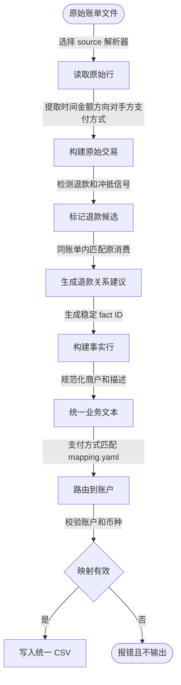

统一阶段会保留退款事实本身。`proposed_action` 只是“建议将退款核销到哪条消费”的关系元数据，既不会在 convert 阶段删除退款，也不会改变原消费金额。

#### 支付宝 convert

支付宝账单的业务信息通常最完整：交易号可作为稳定事实 ID，状态、收支方向和订单描述共同提供退款识别和原单回链证据。商户脱敏展示不影响事实 ID；原始对手方、原始描述和支付方式会写到 `raw_*` 字段，供后续审查使用。

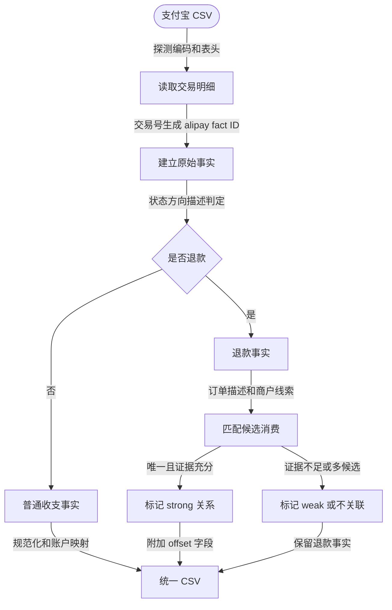

#### 微信 convert

微信账单使用交易单号作为优先事实 ID。退款配对除了状态外，还会尝试设备号、美团订单号、收银台号、稳定描述 token 和品牌别名；群收款、红包、个人转账等社交流量不会因为金额相同而被当作普通商户退款。

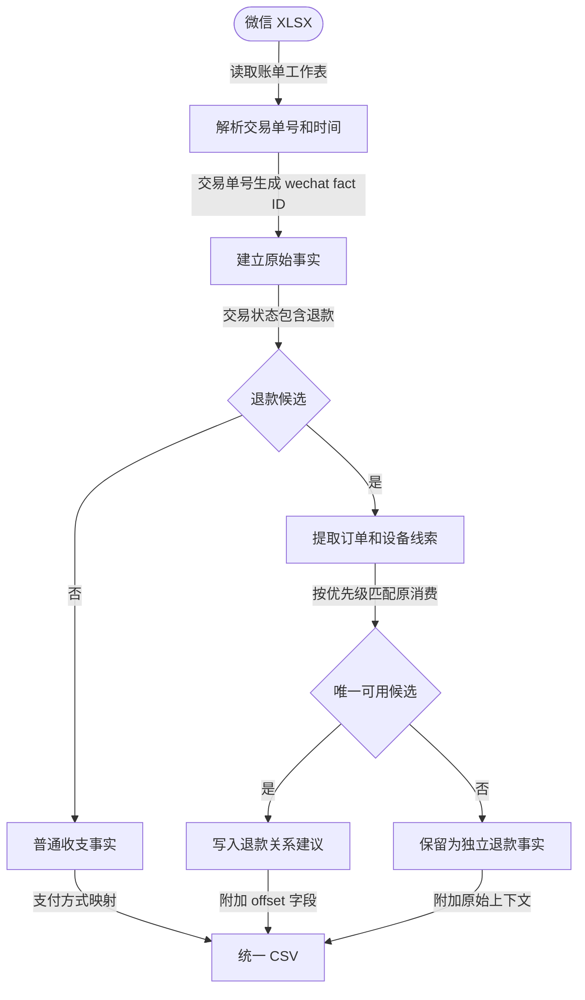

#### 工行 convert

`icbc` 处理加密 PDF，并根据解析到的账单结构自动区分信用卡和借记卡；`icbc-debit` 处理借记卡表格格式。信用卡账单可能包含多张卡，必须依赖支付方式和卡号尾号路由到已配置账户。工行记录中的支付渠道文本会被识别为 `source`，但它仍是银行账单事实，后续是否与支付宝/微信镜像去重由 reconcile 决定。

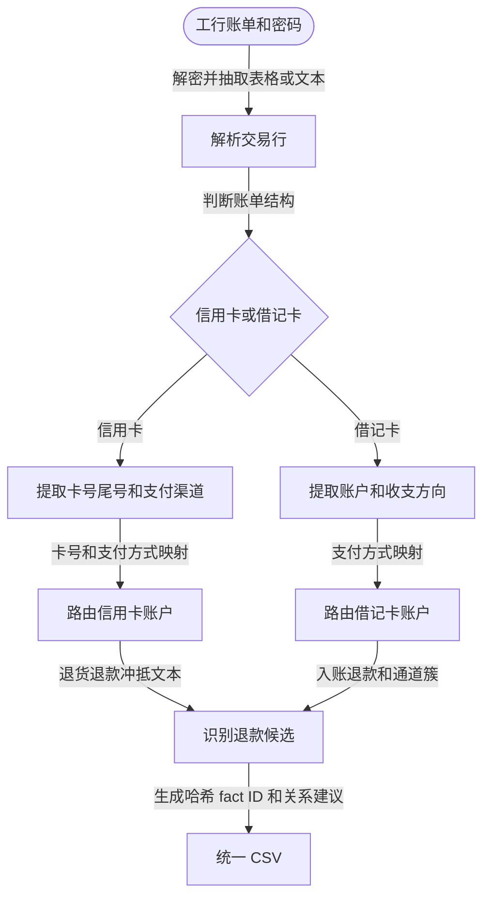

#### 建行借记卡 convert

建行 XLS 的时间粒度通常只有日期。转换器会使用交易字段和余额等信息构建稳定 ID，保留原始对手方和地点线索，并将“消费退货”等入账标记为退款候选。日期缺少时分秒会降低退款配对的置信度，但不妨碍后续 reconcile 在同账户、同日、同额且平台候选唯一时删除银行镜像。

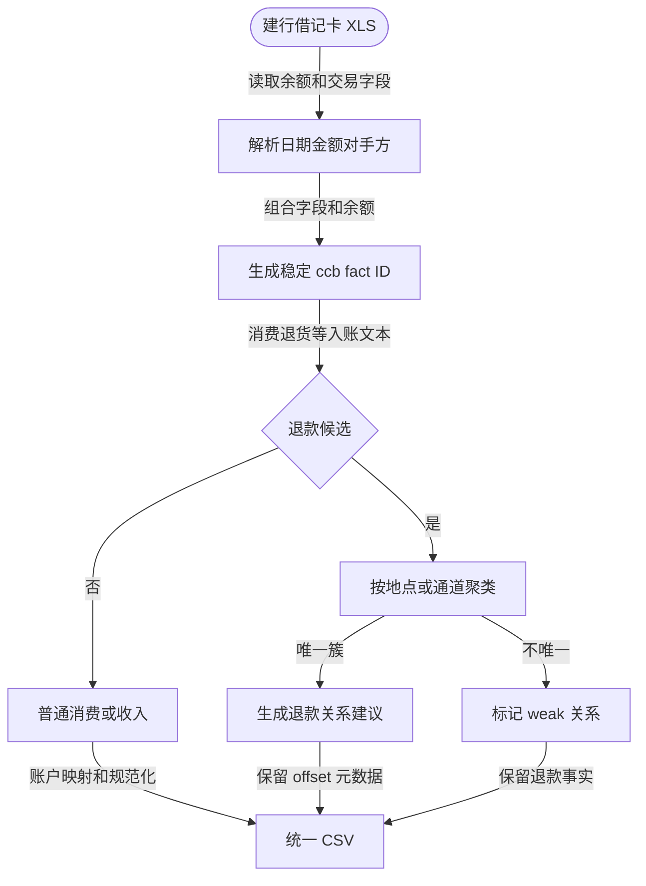

### Convert 产物：统一 CSV

统一 CSV 固定包含 17 个字段：

- 基础事实：`record_id`、`date`、`amount`、`currency`、`counterparty`、`description`、`category`
- 账户与来源：`account_name`、`source`、`bill_source`
- 退款/冲抵关系：`offset_group`、`offset_role`、`offset_strength`、`offset_source`、`offset_rule_hint`、`offset_match_type`、`proposed_action`

其中 `proposed_action` 是 convert 对退款/冲抵关系的建议，不是 reconcile 审查的最终 `decision_action`。普通消费的关系字段通常为空，`proposed_action` 默认为 `leave_as_is`。

```yaml
# /tmp/wechat.csv 中的一行
record_id: wechat_8f21c0
date: "2026-06-12 12:35:31"
amount: "-55.20"
currency: CNY
counterparty: 麦当劳
description: 扫码付款
category: expense
account_name: 工行借记卡
source: 微信
bill_source: wechat
offset_group: ""
offset_role: ""
offset_strength: ""
offset_source: ""
offset_rule_hint: ""
offset_match_type: ""
proposed_action: leave_as_is
```

## 4. Append：统一 CSV 按月落盘

`ft append <converted-1.csv> <converted-2.csv> ...` 在写入前读取所有输入并校验。它按账户类型与交易月份归档为 `records/<type>/<YYYY-MM>.csv`，将既有行与输入行合并、排序后落盘。


append 不负责事实去重或跨来源镜像去重。convert 在构建单份账单的事实集合时使用稳定事实 ID 排除同一输入中的重复行；微信/支付宝账单与银行卡账单之间的镜像仍应被保留到 records，交由 reconcile 在拥有完整上下文时处理。

### Append 产物：records 与 snapshot

append 将统一 CSV 按账户类型和月份写成 records。正式 records 固定包含 19 个字段：

- 基础事实：`record_id`、`date`、`amount`、`currency`、`counterparty`、`description`、`category`
- 账户与来源：`account_name`、`source`、`bill_source`、`transfer_account`、`locked`
- 退款/冲抵关系：`offset_group`、`offset_role`、`offset_strength`、`offset_source`、`offset_rule_hint`、`offset_match_type`、`proposed_action`

convert 没有输出的 `transfer_account` 和 `locked` 在 append 时补为空字符串。`locked=1` 表示人工锁定，reconcile 不会修改、去重或转账配对该行。

```yaml
# records/cash/2026-06.csv 中的一行
record_id: wechat_8f21c0
date: "2026-06-12 12:35:31"
amount: "-55.20"
currency: CNY
counterparty: 麦当劳
description: 扫码付款
category: expense
account_name: 工行借记卡
source: 微信
bill_source: wechat
transfer_account: ""
locked: ""
offset_group: ""
offset_role: ""
offset_strength: ""
offset_source: ""
offset_rule_hint: ""
offset_match_type: ""
proposed_action: leave_as_is
```

append 同时更新 `snapshot.yaml`。它的顶层字段是 `updated_at` 和 `accounts`；现金、负债、借贷账户按“账户名 -> 币种 -> 余额”存储：

```yaml
updated_at: "2026-07-14 20:30:00"
accounts:
  cash:
    工行借记卡:
      CNY: 1234.56
  loan: {}
  lend: {}
  security: {}
```

## 5. Reconcile：自动规则与待审门禁

`ft reconcile` 可处理全量、单月或日期范围。它先读取 scope 内 records，保留 `locked=1` 的人工锁定事实，并生成一份 reconciliation state。

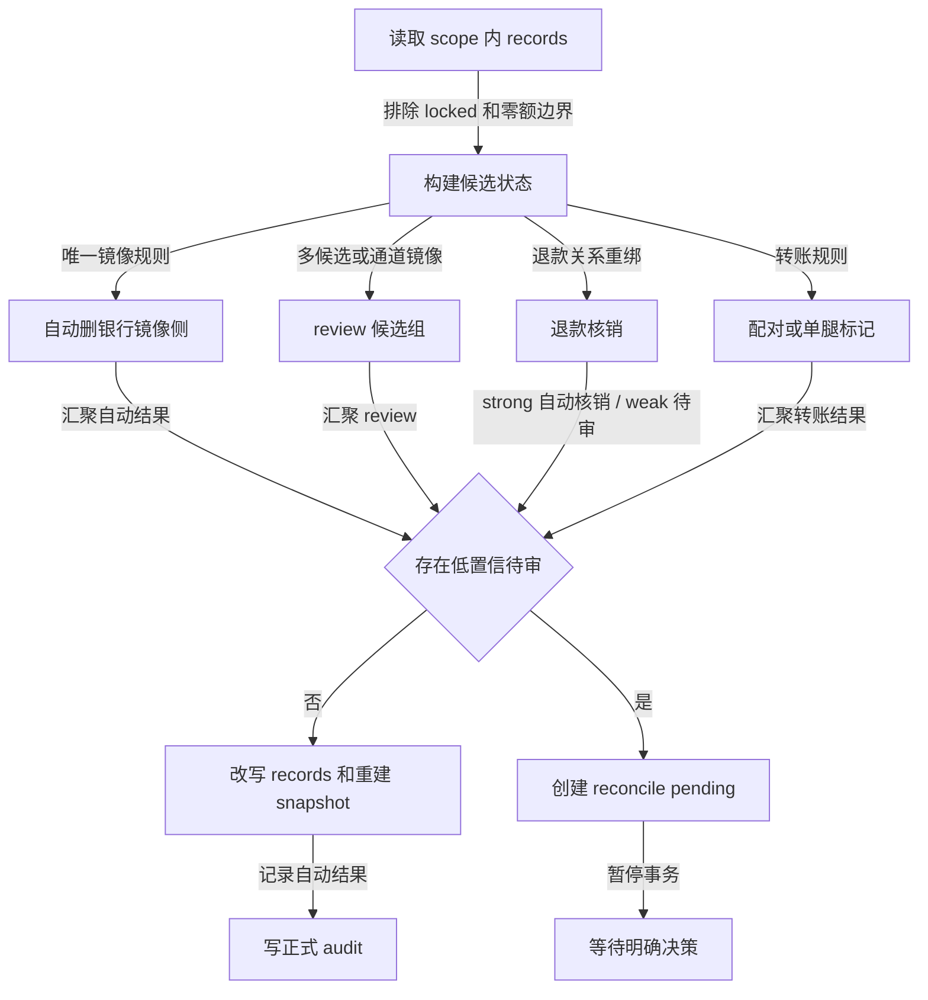

### Reconcile 范围编排

reconcile 只处理命令给定的月份或日期范围，但读取时会保留每一行所属的 records 文件，以便写回时只替换本轮涉及的 `record_id`。`locked=1` 是硬边界：锁定行不参与去重、退款关系、转账识别或单腿转账标记，并按原样写回。

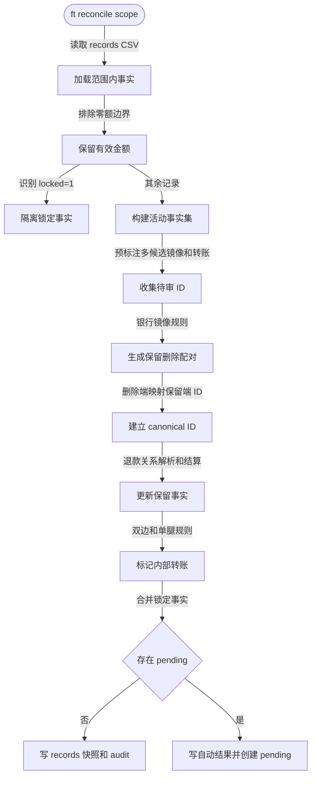

### 镜像去重规则

镜像去重处理的是同一笔资金同时存在于支付平台账单和银行账单中的双重事实。它不是退款核销：镜像删掉的是重复展示的银行资金腿，退款核销处理的是消费与退款之间的净额。

| 场景 | 候选前提 | 自动结果 | 待审条件 |
| --- | --- | --- | --- |
| 建行借记卡日期级镜像 | 同账户、同日、同金额、同币种；支付宝/微信候选 | 平台候选唯一且平台记录有完整时间时，删除建行侧 | 同日同额的平台候选超过一条 |
| 工行信用卡镜像 | 同账户、秒级接近、同金额、同币种 | 唯一高置信候选时删除银行侧 | 多候选或时间/账户不兼容 |
| 工行借记卡支付通道 | 同账户、秒级接近、同金额、同币种；银行侧显示支付宝/财付通等通道 | 不作为普通商户镜像静默删除 | 生成 `ai_group`，由人工确认保留平台侧还是银行侧 |
| 平台侧社交流量 | 微信转账、群收款、红包等 | 不因金额相同单独自动删除 | 与银行通道记录形成候选时进入 pending 审查 |

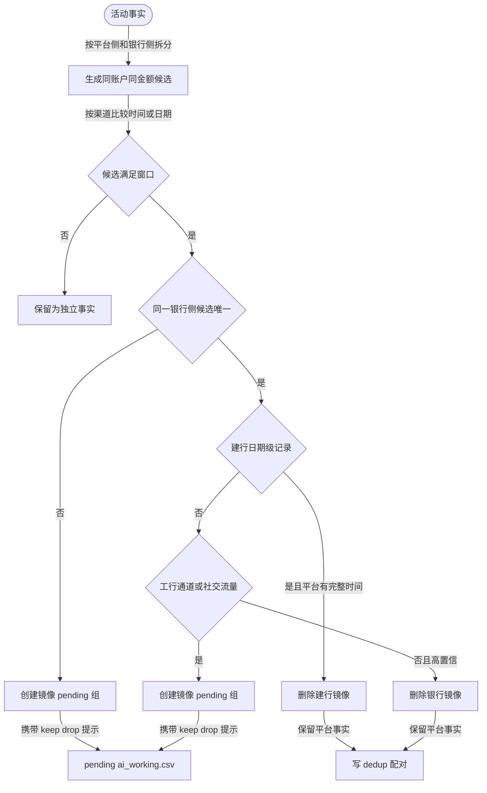

建行日期级规则故意允许清算主体与订单商户名称不同。银行账单中的“对手方”可能是收单机构、聚合商户或个人收款展示；只要同账户、同日、同额的平台候选唯一，平台订单就是该银行扣款的业务明细。候选不唯一时才必须人工判断，不能按名称相似度随意配对。

### 退款关系、重绑和核销

退款关系在 convert 中以 `proposed_action=merge_refund_into:<消费 ID>` 保存。reconcile 先完成镜像去重，再把关系端的已删除 ID 沿 canonical ID 映射到保留事实。该顺序保证“先去掉双重银行腿，再以单一事实计算净额”。

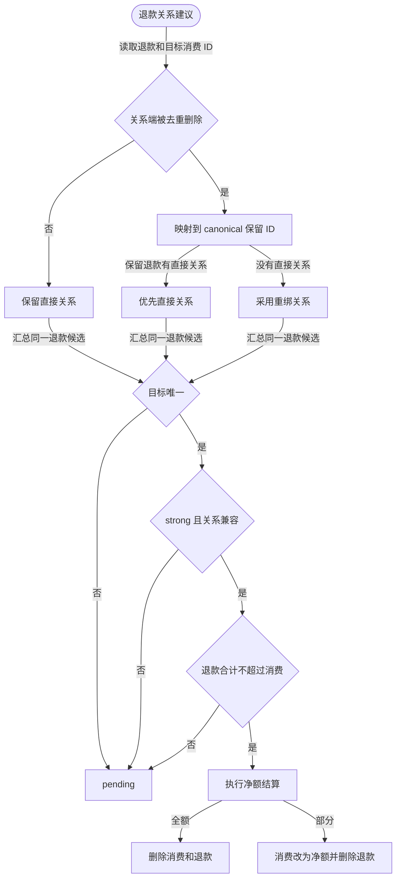

`strong` 是自动核销资格，不等于“退款一定会被删除”。自动结算还要求：退款为正、消费为负、账户和币种一致、两侧未锁定、两侧未进入镜像待审、同一消费的退款总额不超过消费金额。任何一项不满足，或 `offset_strength=weak`，都保留原始事实并进入 pending；审查者确认后才通过 `merge_refund_into:<消费 ID>` 使用同一套净额结算器。

### Pending 和 continue

pending 不是重新导入文件，也不是可编辑的正式 records 副本。它保存系统的原始审查底稿和一份待写回决定；`ai_working.csv` 中的事实字段和 `processing_status` 都是只读的。自动删除行显示为 `dropped`，用于解释整条链路，continue 时不会恢复该行。

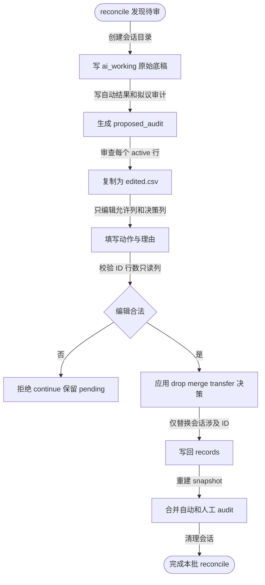

### 自动判定

reconcile 的自动结果包括：

- 唯一镜像：支付宝或微信是业务事实侧，银行账单是资金扣款侧。两侧同账户、同金额、同币种且候选唯一时，删除银行侧、保留平台侧。工行有完整时间时使用秒级窗口；建行借记卡只有日期时使用同日窗口，但仍要求平台侧有完整时间且同日同额候选唯一。建行的清算主体、个人收款人名称可以与支付宝/微信展示的订单商户不同，不能单独据此否定镜像关系。
- 明确 `strong` 退款：在镜像去重和关系重绑后结算。要求退款与消费同账户、同币种、方向正确、均未锁定或进入镜像待审，且同一消费的退款合计不超过消费金额。部分退款保留原消费 ID 并改写为净额、删除退款；全额退款删除消费与退款两条记录。
- 明确转账：标记两侧 `transfer_out`/`transfer_in`；无法配对但信号明确时可标记单腿转账。

这里的“镜像弱侧”表示银行渠道记录的事实完整度较低，与退款关系的 `offset_strength=weak` 不是同一概念。建行日期级镜像在候选唯一时可以自动删除；同日同额存在多个支付宝/微信候选时才进入 pending。工行借记卡的支付宝/财付通等通道扣款、社交流/红包/群收款/转账等需要人工判断的镜像候选也进入 pending。

退款关系使用 `proposed_action=merge_refund_into:<expense_record_id>` 保存退款到消费的事实关联。镜像去重删除退款链任一侧时，reconcile 会把关系端映射到保留 ID：若保留退款自身已有直接关系，优先保留这条直接关系，不让被删除的银行退款镜像覆盖它；只有保留退款没有直接关系时，才采用镜像行的重绑关系。重绑后存在多个目标、金额/币种/账户/方向不兼容、退款总额超过消费金额，或消费仍在镜像审查中时，关系不自动结算；`weak` 退款随关联行进入 pending。没有可用关系时，幸存事实保持未核销状态。

### Reconcile pending 的内容

当存在 review 候选时，程序创建：

```text
pending/reconcile/<session_id>/
├── manifest.json
├── status.json
├── ai_working.csv
├── staged_records/
└── proposed_audit.csv
```

`ai_working.csv` 提供候选及必要上下文，包含 weak 退款的消费与退款两侧，以及已经自动删除的行。自动删除行以 `processing_status=dropped` 显示，便于审查整条链路，但不会在 continue 时被恢复。一个 scope 同时存在自动结果和待审项时，自动去重、强退款核销和自动审计会先写入正式 records；pending 只暂停仍需明确决策的记录，continue 只替换本会话涉及的 `record_id`。

### Reconcile 产物：审查底稿、暂存副本与拟议审计

`manifest.json` 的字段是 `session_id`、`kind`（固定为 `reconcile`）、`created_at`、`scope_from`、`scope_to`；`status.json` 的字段是 `session_id` 和 `status`，新会话状态为 `waiting_for_decisions`。

示例 `manifest.json`：

```json
{
  "session_id": "reconcile_2026-07-14_20-30-00",
  "kind": "reconcile",
  "created_at": "2026-07-14_20-30-00",
  "scope_from": "2026-06-01",
  "scope_to": "2026-06-30"
}
```

示例 `status.json`：

```json
{
  "session_id": "reconcile_2026-07-14_20-30-00",
  "status": "waiting_for_decisions"
}
```

`ai_working.csv` 的字段如下：

- 事实标识：`record_id`
- 事实内容：`date`、`amount`、`currency`、`counterparty`、`description`、`category`、`account_name`、`source`、`bill_source`、`transfer_account`、`locked`
- 退款/冲抵关系：`offset_group`、`offset_role`、`offset_strength`、`offset_source`、`offset_rule_hint`、`offset_match_type`、`proposed_action`
- 原始和定位上下文：`raw_counterparty`、`raw_description`、`raw_payment_method`、`record_file`、`record_type`
- 系统提示与审查结果：`rule_hint`、`suggested_action`、`decision_action`、`decision_reason`、`processing_status`、`ai_group`

```yaml
# pending/reconcile/<session_id>/ai_working.csv 中的镜像候选
record_id: icbc_debit_a91f           # 正式 records 的事实 ID，只读
date: "2026-06-12 12:35:32"
amount: "-55.20"
currency: CNY
counterparty: 深圳市财付通支付科技有限公司
description: 消费
category: expense
account_name: 工行借记卡
source: 银行卡
bill_source: icbc_debit
rule_hint: possible_mirror_weak_30s_cross_source
suggested_action: drop
decision_action: drop
decision_reason: 同账户同金额，微信侧为具体商户，银行卡侧为通道扣款
processing_status: active
ai_group: mirror_0001
```

`staged_records/` 是本次 scope 内原始 records 文件的副本，每个 CSV 使用上文的 19 列正式 records schema。`proposed_audit.csv` 使用下文 audit schema，包含已自动判定的结果和等待人工继续时应一并落盘的审计行。

## 6. Reconcile Pending 决策语义

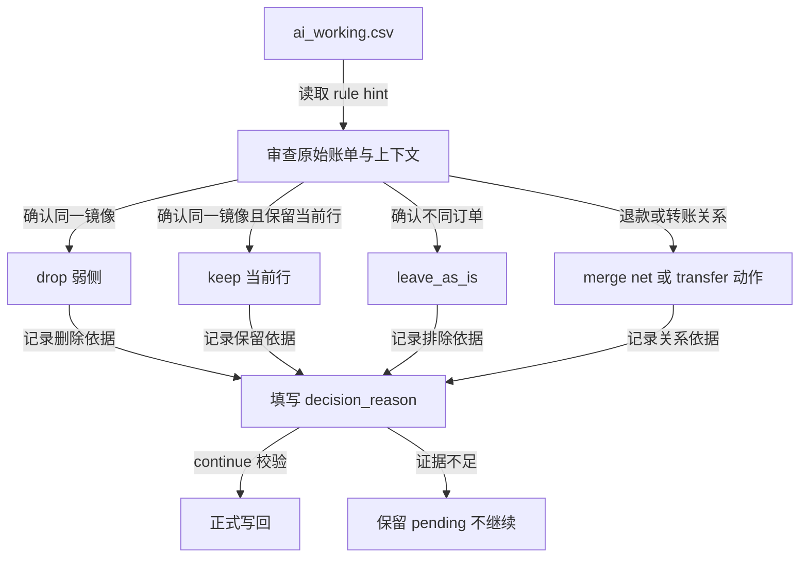

字段分工：

- `rule_hint`：程序命中的候选规则，例如 `possible_mirror_weak_30s_cross_source`。
- `suggested_action`：程序建议的动作，例如弱侧 `drop`、强侧 `keep`；它不是审查结论。
- `decision_action`：审查者最终选择的 `keep`、`leave_as_is`、`drop`、`modify`，或退款/转账的引用动作。弱退款确认使用 `merge_refund_into:<消费 record_id>`；部分退款改写消费净额并删除退款，全额退款删除两侧。
- `decision_reason`：审查者写入的证据和结论。带 `ai_group` 的 `processing_status=active` 行选择 `keep` 或 `leave_as_is` 时必须填写；`drop`、`modify`、退款合并和转账动作同样必须填写。
- `processing_status`：系统描述的工作行状态；自动删除行通常是 `dropped`，不可由审查者编辑。

`leave_as_is` 的含义是“已明确确认它不是需要处理的同一笔订单”，不能用来表示“暂时不确定”。证据不足时必须保持 pending，而不是调用 continue。

continue 固定读取当前 pending 会话目录中的 `edited.csv`，并校验行数、真实 `record_id` 集合、只读事实字段、双边转账关系和每个决策理由。它只替换 pending 涉及的真实 `record_id`，保留同一月文件中未触及的其他记录；确认的 weak 退款和自动结果使用同一结算规则，随后重建 snapshot，并将自动审计与人工审计合并写入正式 audit。

### Reconcile 产物：正式 audit

无 pending 的 reconcile，或 pending continue 成功后，都会写出 `audit/reconcile/<run_at>.csv`。其字段分为：

- 运行范围：`run_at`、`scope_from`、`scope_to`
- 被处理的正式事实：`record_id`、`date`、`amount`、`currency`、`counterparty`、`description`、`category`、`account_name`、`source`、`bill_source`、`transfer_account`、`locked`、`offset_group`、`offset_role`、`offset_strength`、`offset_source`、`offset_rule_hint`、`offset_match_type`、`proposed_action`
- 审计定位与结论：`record_file`、`dedup_status`、`reconcile_status`。退款会分别记录消费与退款，并通过对手记录字段追溯重绑、部分核销或全额核销。
- 转账对手信息：`transfer_side`、`match_rule`、`match_confidence`、`counterpart_file`、`counterpart_account`、`counterpart_currency`、`counterpart_amount`

```yaml
# audit/reconcile/2026-07-14_20-31-00.csv 中的一行
run_at: "2026-07-14_20-31-00"
scope_from: "2026-06-01"
scope_to: "2026-06-30"
record_id: icbc_debit_a91f
date: "2026-06-12 12:35:32"
amount: "-55.20"
currency: CNY
counterparty: 深圳市财付通支付科技有限公司
category: expense
account_name: 工行借记卡
source: 银行卡
bill_source: icbc_debit
record_file: "/path/to/.ft/records/cash/2026-06.csv"
dedup_status: 去除
reconcile_status: ai_drop
transfer_side: ""
match_rule: ai_dedup_decision
match_confidence: ai
counterpart_file: ""
counterpart_account: ""
counterpart_currency: ""
counterpart_amount: ""
```

## 7. 完成、校验与提交

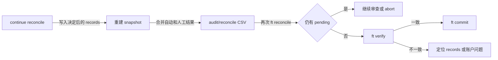

完成条件：

1. 再次运行同一 scope 的 reconcile 不产生 pending。
2. `ft verify` 通过：cash/loan/lend 的账户引用有效，security 记录可重放且与快照一致。
3. audit 同时包含自动去重、转账处理和人工决策，能够解释每次删除或配对。
4. 确认无误后再执行 `ft commit`，将本次账本导入作为一个 Git 提交固定下来。

### Verify 与 Commit 产物

`ft verify` 不写新的账本文件（仅 `--fix` 会重建 `snapshot.yaml`），产物是进程退出码和校验输出：

```text
🔍 Security 校验
  ...
🔍 Cash/Loan/Lend 校验
  ...
✅ 校验通过
```

`ft commit -m "导入 2026-07 账单"` 的产物是 `.ft` 仓库的 Git commit。其可追溯字段由 Git 提供：commit hash、父提交、author、committer、提交时间和 message；命令不额外创建业务 CSV 或 YAML。

## 8. 操作检查表

```bash
# 1. 转换每份原始账单
FT_DIR=/path/to/.ft uv run ft convert bill.xlsx --source wechat --output /tmp/wechat.csv

# 2. 统一追加
FT_DIR=/path/to/.ft uv run ft append /tmp/wechat.csv /tmp/alipay.csv /tmp/bank.csv

# 3. 自动整理；若进入 pending，逐行明确填写 decision_reason
FT_DIR=/path/to/.ft uv run ft reconcile
FT_DIR=/path/to/.ft uv run ft reconcile --continue-with-decisions

# 4. 验证幂等性和一致性
FT_DIR=/path/to/.ft uv run ft reconcile
FT_DIR=/path/to/.ft uv run ft verify

# 5. 确认后提交账本
FT_DIR=/path/to/.ft uv run ft commit -m "导入 2026-07 账单"
```

对于临时验证环境，最后一步可以省略；不要提交只用于验证的账本变更。
