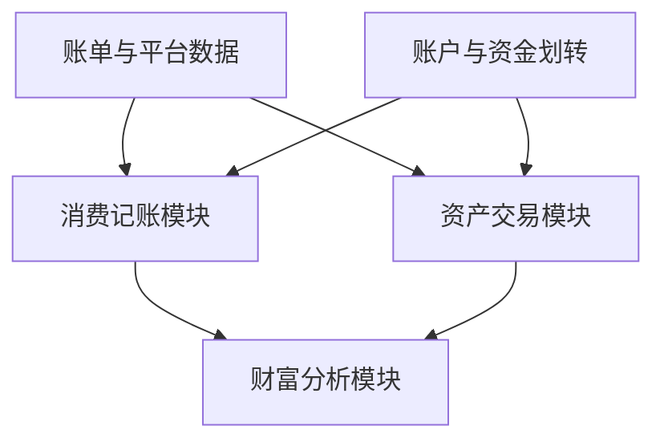
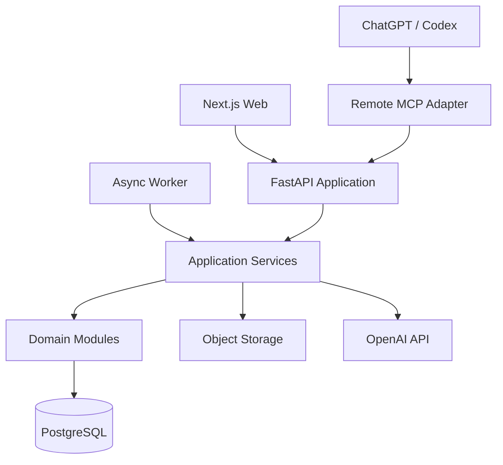

# Finance Tracker Web 产品化与渐进重构计划

> 状态：Draft
> 目标分支：`refactor/web`
> 面向范围：产品定位、领域拆分、Web 前后端、AI 能力、Agent Skill/MCP 集成、现有 CLI 渐进迁移

## 1. 执行摘要

Finance Tracker 当前已经不是一个简单的记账 CLI。它已经具备账单导入、多币种账户、退款配对、去重与转账识别、证券与加密资产交易、外部平台同步、快照重建、审计以及 AI 辅助复核等领域能力。

本次重构的目标不是为 CLI 加一个 Web 外壳，而是把现有能力抽取成可复用、可测试、可审计的财务领域内核，并在此基础上建设三个相对独立的产品域：

1. **消费记账模块**：回答用户在一段时间内收入多少、消费多少、钱花到了哪里。
2. **资产交易模块**：回答用户把资金配置到了哪里、发生了哪些交易、投资增值多少。
3. **财富分析模块**：只读聚合前两个模块，解释净资产变化由储蓄、投资收益、汇率和其他调整分别贡献了多少。

目标产品的一句话定位是：

> 面向多账户、多币种和多资产用户的 AI 财务账本：统一消费、储蓄与投资数据，并用可审计的方式解释财富变化。

重构采用模块化单体和渐进迁移策略。现有 CSV/YAML/Git 本地模式在迁移期继续可用；Web 产品使用 PostgreSQL 作为主存储；CLI、Web、异步任务和 MCP 共享同一套 Application Service，不允许各自复制业务规则。

## 2. 背景与现状

### 2.1 已有能力

当前仓库已经覆盖：

- 账户、多币种余额和统一快照；
- 支付宝、微信、工行、建行等账单转换；
- 退款事实保留、退款配对、重复交易和转账识别；
- pending / continue / abort 的人工或 AI 复核流程；
- 股票、加密货币和 Polymarket 交易记录；
- Kraken、OKX、Binance、Coinbase、Bybit 等同步入口；
- CSV 审计记录、快照重建、数据一致性检查；
- 本地 Git 暂存与手动提交。

这些能力应尽可能保留，并通过回归测试保护，而不是在 Web 重构中整体重写。

### 2.2 当前主要耦合

现有代码以本地单用户 CLI 为中心，存在以下产品化阻碍：

- 数据目录固定为 `~/.ft`，缺少 user/workspace 隔离；
- CSV/YAML 同时承担审计、查询和运行时存储职责；
- Git 被用于本地事务记录，不适合作为服务端并发事务机制；
- 多数业务函数直接读取全局路径、输出到终端或等待交互输入；
- `cli.py` 同时承担命令解析、业务编排和部分持久化；
- `convert.py`、`stock.py`、`reconcile.py` 体积较大，领域边界不清晰；
- AI 复核依赖编辑整份 CSV，难以实现细粒度审批、并发和 Web 交互；
- 当前根目录 `SKILL.md` 强依赖本地路径和 CLI 命令，无法作为远程产品的稳定集成契约。

### 2.3 重构原则

1. **先抽内核，再加 Web**：禁止后端通过 shell 调用 `ft` CLI。
2. **业务规则只有一份**：CLI、Web、Worker、AI 和 MCP 必须调用相同的应用服务。
3. **两个写模型，统一读模型**：消费记账和资产交易分别维护自己的领域数据，财富分析只做聚合。
4. **确定性规则优先，AI 处理不确定性**：能由程序确定的规则不交给模型。
5. **AI 先生成草稿，再验证和确认**：模型不能绕过后端校验直接修改正式账本。
6. **保留可审计性**：任何自动识别、人工修改和 AI 决策都能追溯原始数据、建议、最终决定和操作者。
7. **避免长期双写**：迁移期间可以 shadow compare，但同一 workspace 在任一时刻只能有一个事实主存储。
8. **先模块化单体，不提前微服务化**。

## 3. 产品定位与范围

### 3.1 目标用户

第一阶段面向以下用户：

- 同时使用银行卡、支付宝、微信、信用卡的用户；
- 持有 CNY、USD、HKD 等多币种资产的用户；
- 同时使用券商、加密货币交易所或预测市场的用户；
- 希望区分“花掉的钱、攒下的钱、投资赚的钱”的用户；
- 重视数据所有权、可导出和审计链的高阶个人财务用户。

### 3.2 差异化价值

第一版不与传统记账 App 竞争社区、预算打卡或装饰性图表，而是聚焦：

- 跨渠道账单统一；
- 消费与投资并列管理；
- 多币种净资产聚合；
- AI 辅助复核而非黑盒自动修改；
- 能解释净资产变化来源；
- 数据可验证、可导出、可重建。

### 3.3 MVP 范围

MVP 包含：

- 用户和 workspace；
- 账户管理；
- 消费账单上传、转换、导入和待审查队列；
- 交易查询、筛选和分类；
- 股票、加密资产和现金持仓；
- 手动交易录入和现有同步器迁移；
- 财富首页和区间财富变化解释；
- AI 自然语言查询和复核建议；
- Remote MCP 的只读工具和少量草稿工具；
- CSV/JSON 导出以及本地数据迁移工具。

MVP 不包含：

- 原生 iOS/Android 客户端；
- 家庭多人协作；
- 自动交易或代客理财；
- 税务申报；
- 全量银行 Open Banking 连接；
- 微服务、Kafka 或向量数据库；
- 复杂预算社区功能。

## 4. 领域边界



### 4.1 消费记账模块

负责解释用户的日常现金流：

- 外部收入：工资、奖金、经营收入、礼金等；
- 消费支出：餐饮、交通、住房、旅行等；
- 退款；
- 信用卡消费和还款；
- 借贷、利息和费用；
- 账户间转账；
- 商户规范化、消费分类、导入去重与退款核销。

必须将当前的交易类型和消费分类分离：

```text
transaction_kind: income | expense | refund | transfer | adjustment
category_id: dining | transport | housing | travel | digital | ...
tags: 可选的用户自定义标签
```

### 4.2 资产交易模块

负责解释投资资金和资产变化：

- 证券、基金、ETF、加密货币、预测市场等 instrument；
- 买入、卖出、换仓；
- 入金、出金；
- 股息、利息、手续费；
- 持仓数量、成本、市值；
- 已实现和未实现盈亏；
- 历史净值和资产配置。

资产买入不是消费，资产卖出不是收入，投资账户入金不是投资收益。它们必须在统计层明确排除，避免重复计算。

### 4.3 财富分析模块

财富分析模块不拥有消费或投资的写入规则。它读取两个模块和公共估值数据，生成面向用户的区间解释。

核心恒等式：

```text
净资产变化 = 收支结余 + 投资收益 + 汇率影响 + 负债重估 + 其他调整
```

其中：

```text
收支结余 = 外部收入 - 净消费支出 - 非投资费用
净消费支出 = 消费支出 - 退款
投资收益 = 期末投资净值 - 期初投资净值 - 净入金
净入金 = 投资模块入金 - 投资模块出金
```

跨模块转账属于用户内部资产位置变化，不计入消费、收入、储蓄或投资收益。

示例：

- 工资收入 20,000；
- 消费 8,000；
- 从银行卡转入券商 5,000；
- 投资增值 1,000。

正确结果为：花费 8,000，收支结余 12,000，向投资账户配置 5,000，投资增值 1,000，净资产增长 13,000。

### 4.4 公共领域

两个模块只通过少量公共对象关联：

- `workspace` 和权限；
- 不可变 `account_id`；
- 币种和金额值对象；
- `fund_transfer`；
- `fx_rate`；
- 原始数据来源和 import batch；
- 审计事件；
- 统一时间和估值口径。

账户展示名不再作为身份。账户通过 UUID/ULID 标识，同名账户和多币种账户均允许存在。

## 5. 产品信息架构

Web 一级导航建议：

1. **财富首页**：净资产、区间变化桥、资产趋势和异常提示；
2. **记账**：收入、消费、退款、分类、商户和交易查询；
3. **投资**：持仓、交易、成本、收益、净入金和资产配置；
4. **待审查**：导入冲突、退款配对、去重和转账候选；
5. **AI 助手**：自然语言查询、解释和草稿操作；
6. **账户与数据源**：账户、账单来源、交易所连接和同步状态。

### 5.1 核心用户流程

#### 导入消费账单

```text
上传原始账单
→ 识别来源与格式
→ 解析为 raw records
→ 确定性标准化和匹配
→ 生成 review cases
→ 用户/AI 审查
→ commit import
→ 更新现金流投影
```

#### 同步资产交易

```text
选择 connector
→ 拉取增量交易
→ external id 去重
→ 转换为 investment events
→ 校验持仓和现金
→ 用户确认异常
→ commit sync
→ 更新投资组合估值
```

#### 查询财富变化

```text
选择时间区间和基础币种
→ 读取收支结余
→ 读取投资净值与净入金
→ 计算汇率和其他重估
→ 对账净资产期初/期末差值
→ 展示财富变化桥及解释
```

## 6. 目标技术架构

### 6.1 总体架构



### 6.2 推荐技术栈

| 层 | 推荐实现 |
|---|---|
| Web | Next.js App Router、React、TypeScript |
| API | FastAPI、Pydantic |
| ORM/迁移 | SQLAlchemy 2、Alembic |
| 数据库 | PostgreSQL |
| 后台任务 | Redis + Dramatiq 或 Celery |
| 原始文件 | S3 兼容对象存储 |
| AI | OpenAI Responses API + function tools |
| Agent 集成 | Streamable HTTP MCP + OAuth |
| 可观测性 | OpenTelemetry、结构化日志、错误追踪 |
| 部署 | 单仓库、独立 Web/API/Worker 容器 |

### 6.3 为什么先做模块化单体

- 当前团队和代码规模不需要微服务；
- 领域规则仍在快速演进；
- 消费、投资和财富聚合需要强一致的内部契约；
- 单体更容易完成数据库事务、测试和本地部署；
- 模块边界稳定后仍可以按 Worker、行情或 connector 服务拆分。

## 7. 后端模块设计

建议目录：

```text
backend/
└── src/ft/
    ├── domain/
    │   ├── shared/
    │   ├── cashflow/
    │   ├── investment/
    │   ├── reconciliation/
    │   └── wealth/
    ├── application/
    │   ├── commands/
    │   ├── queries/
    │   ├── imports/
    │   ├── reviews/
    │   └── ai/
    ├── repositories/
    ├── adapters/
    │   ├── local_csv/
    │   ├── postgres/
    │   ├── importers/
    │   ├── exchanges/
    │   ├── market_data/
    │   └── object_storage/
    ├── api/
    ├── mcp/
    └── workers/
```

### 7.1 Domain 层

- 不依赖 FastAPI、数据库、文件系统、OpenAI SDK 或 CLI；
- 使用明确的 entity、value object、domain service 和 domain error；
- 金额使用 Decimal，禁止在账本计算中继续使用 float；
- 所有时间显式包含时区；
- 领域规则返回结构化结果，不打印终端文本；
- 退款、去重、转账、持仓回放等规则优先迁入此层。

### 7.2 Application 层

- 定义用例和事务边界；
- 处理 workspace 权限、idempotency key 和 optimistic concurrency；
- 编排 repository、connector、market data、AI 和审计；
- 向 CLI/API/MCP 返回统一 DTO；
- 写操作使用 Unit of Work；
- 每次正式修改生成 audit event。

### 7.3 Adapter 层

- `local_csv`：兼容现有 `~/.ft`，支撑渐进迁移；
- `postgres`：Web 产品正式存储；
- `importers`：支付宝、微信、银行和券商文件解析；
- `exchanges`：ccxt、Polymarket 等同步；
- `market_data`：证券、加密货币和汇率行情；
- `object_storage`：原始账单和导入产物。

### 7.4 API 层

API 只负责：

- 身份认证和请求解析；
- 调用 Application Service；
- 将领域异常映射为稳定错误码；
- 返回结构化响应；
- 对长任务返回 job id，而不是阻塞请求。

## 8. 数据架构

### 8.1 公共表

- `users`
- `workspaces`
- `workspace_members`
- `accounts`
- `fund_transfers`
- `fx_rates`
- `import_batches`
- `raw_files`
- `raw_records`
- `audit_events`
- `idempotency_keys`

`fund_transfers` 至少包含：

```text
id
workspace_id
source_account_id
destination_account_id
source_amount
source_currency
destination_amount
destination_currency
fee_amount
fee_currency
occurred_at
status
```

### 8.2 消费记账表

- `cash_transactions`
- `cash_transaction_revisions`
- `cash_categories`
- `merchants`
- `cash_reconciliation_runs`
- `cash_reconciliation_cases`
- `cash_reconciliation_proposals`
- `cash_reconciliation_decisions`

每条正式交易必须保留：

- 稳定内部 ID；
- 原始来源和 source record ID；
- 交易类型与消费分类；
- 原始商户、规范化商户和描述；
- 创建方式：import、manual、rule、AI；
- 当前 revision 和完整修改历史。

### 8.3 资产交易表

- `investment_accounts`
- `instruments`
- `investment_events`
- `investment_event_revisions`
- `position_lots`（可延后实现）
- `position_snapshots`
- `portfolio_snapshots`
- `market_quotes`
- `connector_accounts`
- `sync_cursors`

`investment_event.kind` 至少支持：

```text
buy | sell | swap | deposit | withdrawal | dividend | interest |
fee | position_checkin | cash_checkin | settlement | adjustment
```

### 8.4 财富分析读模型

- `daily_account_balances`
- `daily_portfolio_values`
- `daily_net_worth`
- `wealth_change_breakdowns`

财富分析数据可以由 Worker 定时投影，也可在数据写入后增量更新。任何 breakdown 必须满足：

```text
期末净资产 - 期初净资产
= 收支结余 + 投资收益 + 汇率影响 + 负债重估 + 其他调整
```

如果两侧无法对齐，应显示 `unexplained_adjustment`，不能静默吞掉差异。

### 8.5 多币种和估值

- 原始金额和原始币种永远保留；
- workspace 配置基础展示币种；
- 报表使用对应日期的 FX snapshot；
- 行情和汇率记录 source、observed_at 和 effective_at；
- 区分交易成本、市场价格变化和汇率变化；
- 历史报表不得用当前汇率回算历史财富变化。

## 9. 前端架构

建议结构：

```text
frontend/
├── app/
│   ├── wealth/
│   ├── cashflow/
│   ├── investment/
│   ├── reviews/
│   ├── assistant/
│   └── settings/
├── features/
├── components/
├── api/
└── lib/
```

前端原则：

- 页面按领域组织，不把所有内容放进一个万能 dashboard；
- 服务端返回业务 DTO，前端不重复计算核心财务指标；
- 导入和同步通过 job 状态流展示；
- 待审查页面以 case 为单位，而不是让用户编辑整份 CSV；
- 所有 AI 写入建议展示 before/after、金额影响、证据、理由和数据来源；
- 大额或批量修改必须二次确认；
- Web 第一版响应式适配移动端，不立即开发原生 App。

### 9.1 UI 定位与页面密度

Web 的设计定位为“审计友好的财富工作台（calm overview + dense operations）”。不采用以渐变、大数字和装饰卡片为主的营销型 Fintech 风格，也不把整个产品设计成 Bloomberg 式高密度终端。

不同页面根据任务性质使用不同的信息密度：

| 页面区域 | 密度 | 设计目标 |
|---|---:|---|
| 财富首页 | 中等 | 克制、解释型，突出净资产变化、财富变化来源和异常提示 |
| 记账与投资列表 | 较高 | 表格优先，支持筛选、排序、列管理、批量查看和逐层下钻 |
| Review Inbox | 最高 | 同屏呈现原始记录、建议、diff、金额影响、证据和决策入口 |
| AI 助手 | 中等 | 对话作为查询入口，结构化结果和数据引用作为主体 |
| 移动端 | 较低 | 支持查询、确认和轻操作；复杂审查和批量操作保持桌面端优先 |

财富首页、操作列表和审查工作台共享同一套设计令牌和领域组件，但不得为了视觉统一而强行使用相同布局密度。

### 9.2 财务视觉语义

- 浅色为默认主题，深色作为可选模式；
- 金额、价格、数量和百分比使用 `tabular-nums`，并统一小数精度和正负号规则；
- 币种必须靠近金额展示，不同币种不得在没有汇率口径和基础币种说明时直接合计；
- 投资收益使用绿色和正号/箭头，投资亏损使用红色和负号/箭头；
- 正常消费和现金流出使用中性色、方向和分类表达，不默认使用表示错误或风险的红色；
- 待审查使用琥珀色和状态标签，内部转账使用蓝色和转账图标；
- 未解释调整使用醒目中性色或紫色，并同时提供警示图标和文字；
- 任何状态不得只依赖红绿颜色区分，必须同时提供文字、符号、图标或形状；
- 色彩使用 `positive`、`negative`、`pending`、`transfer`、`unexplained`、`risk` 等语义令牌，业务组件不得硬编码具体色值。

财富变化桥不是装饰性图表。它必须按照 `收支结余 / 投资收益 / 汇率影响 / 负债重估 / 其他调整` 展示，并允许逐层下钻到组成交易、持仓、估值和审计事件。

### 9.3 审查与 AI 交互

规则或 AI 生成的写入建议采用统一交互结构：

```text
原始数据
→ 建议结果
→ before / after diff
→ 金额、余额和持仓影响
→ 证据、判断依据和规则/模型来源
→ 用户批准、修改或拒绝
→ 最终审计事件
```

模型置信度只有经过离线评估和校准后才能面向用户展示。第一版优先展示证据、理由、数据来源、影响范围和可撤销性，避免用未经校准的百分比制造虚假确定感。

建议沉淀以下财务领域组件：

```text
Money
CurrencyAmount
Delta
TransactionDataTable
PositionTable
AuditDiff
ReviewDecisionPanel
AsyncJobStatus
WealthBridge
ExplainabilityDrawer
DataFreshness
SourceReference
```

### 9.4 前端实现基线

建议在 Next.js App Router 和 TypeScript 基础上采用：

| 能力 | 推荐实现 | 使用边界 |
|---|---|---|
| 基础组件 | shadcn/ui | 作为可维护的组件源码和 registry，不替代财务领域设计系统 |
| 样式和主题 | Tailwind CSS + CSS variables | 承载设计令牌、浅色/深色主题和响应式规则 |
| 数据表格 | TanStack Table | 交易、持仓、Review case、审计事件的筛选、排序和列管理 |
| 虚拟滚动 | TanStack Virtual | 用于大交易量和长审计列表，不对小数据集提前复杂化 |
| 客户端数据 | TanStack Query | 用于 job 轮询、交互更新和客户端筛选，不与 Server Components 重复缓存 |
| 表单与校验 | React Hook Form + Zod | 手动录入、草稿、审批和二次确认 |
| 数据可视化 | Apache ECharts | 财富变化桥、时间序列、资产配置和可下钻图表 |
| 本地化 | `Intl` + date-fns | 金额、币种、时区和地区化日期展示 |

首屏查询优先使用 Server Components。高交互表格、异步 job 和审批状态使用 Client Components；ECharts 采用客户端懒加载，避免扩大首屏 bundle 和 SSR 复杂度。

### 9.5 响应式、状态与无障碍

- 时间区间、筛选、排序、分页和可分享的视图状态写入 URL；
- 桌面端允许固定表头、固定关键列和批量操作，移动端降级为摘要卡片和可展开明细；
- 每个异步数据区域必须定义 Loading、Empty、Error、Partial、Stale 和 Retry 状态；
- 图表必须提供数据摘要、可访问名称、非颜色编码和查看明细的替代入口；
- 表格、筛选器、弹窗、上传、审批和二次确认必须支持键盘操作、明确焦点态和合理的焦点恢复；
- 第一版以 WCAG 2.2 AA 为目标，对比度、语义 HTML、ARIA、屏幕阅读器提示和减少动效偏好纳入验收。

### 9.6 设计与实施 Skills

以下 Skills 用于研发过程，不属于产品运行时依赖：

| Skill | 用途 | 使用阶段 |
|---|---|---|
| `frontend-design` | 建立符合产品语境的视觉方向，避免模板化 AI 风格 | 页面设计与实现 |
| `shadcn` | 管理基础组件、registry、主题和组件组合 | 前端基础设施与组件开发 |
| `web-design-guidelines` | 审核 UI/UX、交互反馈、表单、键盘操作和无障碍 | 每个核心页面实现后 |
| `ui-craft-dense-dashboard` | 提供高密度操作台的布局和数字展示参考 | Review Inbox、交易和审计页面按需使用 |

`ui-craft-dense-dashboard` 不作为全站视觉规范。首页仍以解释财富变化和降低认知负担为优先目标。

## 10. AI 能力设计

### 10.1 产品内 AI 的职责

优先实现：

1. 自然语言查询消费、收入、账户和持仓；
2. 解释区间净资产变化；
3. 为低置信度 reconciliation case 提供建议和理由；
4. 商户规范化和消费分类建议；
5. 异常消费、可能重复扣款和未匹配转账提示；
6. 投资组合情景分析。

AI 不负责：

- 绕过确定性规则；
- 直接执行交易；
- 未经确认批量删除或修改账本；
- 自由访问数据库或生成任意 SQL；
- 把模型输出当成不可追溯的最终事实。

### 10.2 AI 工具调用流程

```text
用户意图
→ 模型调用只读领域工具
→ 模型生成结构化 draft
→ 后端 validator 校验
→ 返回影响预览
→ 用户确认
→ application service commit
→ audit event
```

推荐从单 Agent + function tools 开始。只有在出现明显不同的权限、工具集、审批策略或 trace 需求时，再引入分类 Agent、投资分析 Agent 等 specialist。

### 10.3 工具分组

消费记账：

```text
cashflow.get_summary
cashflow.search_transactions
cashflow.list_review_cases
cashflow.explain_review_case
cashflow.create_draft_change
cashflow.validate_draft
```

资产交易：

```text
portfolio.get_summary
portfolio.list_positions
portfolio.list_events
portfolio.get_return_breakdown
portfolio.run_scenario
```

财富聚合：

```text
wealth.get_net_worth
wealth.get_change_breakdown
wealth.explain_change
```

正式写入：

```text
finance.commit_draft
finance.commit_review_decisions
```

### 10.4 AI 数据和隐私

- 只发送完成任务所需的最小字段；
- 原始卡号、证件号、API secret 和 PDF 密码不得进入模型上下文；
- 对 raw description 中的敏感内容提供脱敏层；
- 保存 prompt version、model、tool calls、proposal 和最终决定；
- 用户可配置 AI 是否允许读取原始描述；
- AI trace 与正式审计日志分离保存；
- 建立去标识化的 eval 数据集，不直接使用生产明文数据。

## 11. Agent Skill 与 MCP 集成

### 11.1 边界

```text
Skill：定义何时使用和完整工作流
MCP：暴露真实数据和受控动作
Application Service：执行权限、校验和事务
```

新 Skill 不应继续要求 Agent 直接编辑 `~/.ft` 或 shell 调用 CLI。远程用户通过 OAuth 连接 MCP，由后端从 token 解析 workspace，工具参数中不接受任意 `user_id` 或 `workspace_id` 冒充身份。

### 11.2 MCP 工具分级

第一阶段只读：

- `finance.get_overview`
- `finance.list_accounts`
- `finance.search_transactions`
- `finance.get_portfolio`
- `finance.list_review_cases`

第二阶段草稿：

- `finance.draft_transaction`
- `finance.draft_transfer`
- `finance.propose_review_decision`

第三阶段确认写入：

- `finance.commit_draft`
- `finance.commit_review_run`
- `finance.sync_connector`

每个 MCP tool 必须提供稳定 JSON Schema、结构化结果和准确的安全 annotations。写操作必须支持 idempotency key、版本检查和用户确认。

### 11.3 Skill 拆分与分发

将当前超长 Skill 拆为：

- `finance-tracker-query`
- `finance-tracker-import`
- `finance-tracker-reconcile`
- `finance-tracker-portfolio`

仓库内开发版本放在 `.agents/skills/`。面向用户分发时，将 Skills、MCP 配置和必要的应用映射包装为 plugin。原根目录 `SKILL.md` 在本地 CLI 兼容期继续保留，待远程 Skill 稳定后再标记 deprecated。

## 12. API 草案

### 12.1 公共与账户

```text
GET    /v1/accounts
POST   /v1/accounts
PATCH  /v1/accounts/{account_id}
GET    /v1/fx-rates
POST   /v1/transfers/drafts
POST   /v1/transfers/drafts/{draft_id}/commit
```

### 12.2 消费记账

```text
POST   /v1/cashflow/imports
GET    /v1/cashflow/imports/{import_id}
GET    /v1/cashflow/transactions
POST   /v1/cashflow/transactions/drafts
PATCH  /v1/cashflow/transactions/{transaction_id}
GET    /v1/cashflow/review-cases
POST   /v1/cashflow/review-cases/{case_id}/decision
POST   /v1/cashflow/reconciliation-runs/{run_id}/commit
GET    /v1/cashflow/summary
```

### 12.3 资产交易

```text
GET    /v1/investment/accounts
GET    /v1/investment/events
POST   /v1/investment/events/drafts
GET    /v1/investment/positions
GET    /v1/investment/returns
POST   /v1/investment/connectors/{connector_id}/sync
GET    /v1/investment/sync-jobs/{job_id}
```

### 12.4 财富分析

```text
GET    /v1/wealth/overview
GET    /v1/wealth/history
GET    /v1/wealth/change-breakdown
GET    /v1/wealth/allocation
```

API 约束：

- 分页使用 cursor；
- 所有写接口支持 idempotency key；
- 修改接口携带 expected version；
- 长任务返回 job；
- 错误返回稳定 machine-readable code；
- 金额以字符串形式传输，避免 JSON float 精度问题。

## 13. 现有代码迁移映射

| 当前模块 | 目标模块 |
|---|---|
| `models.py` | `domain/shared` 和配置层 |
| `accounts.py`、`acct.py` | `domain/shared/accounts` + repository |
| `convert.py`、`importers/` | `adapters/importers` + `application/imports` |
| `append.py` | local CSV repository / import commit service |
| `dedup.py`、`mirror_rules.py` | `domain/reconciliation/dedup` |
| `transfer_rules.py` | `domain/reconciliation/transfers` |
| `reconcile.py` | `application/reviews` + domain rules |
| `ai_working_csv.py` | local review compatibility adapter |
| `ai_apply.py` | review decision application service |
| `stock.py` | `domain/investment` + application commands |
| `exchange_sync.py` | `adapters/exchanges/ccxt` |
| `polymarket_sync.py` | `adapters/exchanges/polymarket` |
| `report.py` | `application/queries` 和 wealth projectors |
| `snapshot.py` | local repository + valuation projectors |
| `credentials.py` | secret store adapter |
| `cli.py` | 薄 CLI adapter |

## 14. 渐进迁移计划

### Phase 0：建立基线

目标：在不改变行为的前提下，固定重构安全网。

工作项：

- 整理核心命令和数据格式的 characterization tests；
- 为账单转换、退款、去重、转账、持仓回放补充 golden fixtures；
- 记录当前 CSV/YAML schema 版本；
- 为关键财务恒等式建立测试；
- 建立 ADR/RFC 目录和代码所有权边界；
- CI 固定 Python 版本、依赖锁和测试命令。

验收：

- 当前 CLI 行为有自动化基线；
- 关键样例可以从原始账单重建相同快照；
- 重构 PR 能判断行为变化是否预期。

### Phase 1：抽取 Application Service

目标：解除 CLI、全局路径和业务规则的直接耦合。

工作项：

- 引入 `domain/`、`application/`、`repositories/`、`adapters/`；
- 定义 AccountRepository、CashflowRepository、InvestmentRepository、ReviewRepository、UnitOfWork；
- 把 `FT_DIR` 注入 local adapter；
- 把 print/input 移到 CLI adapter；
- 业务代码返回 DTO 或抛出 domain error；
- CLI 调用 application service，保持命令行为兼容；
- 将金额计算逐步迁移到 Decimal。

验收：

- 领域和应用层测试不依赖用户 home 目录；
- CLI 不再直接实现新增交易、余额写入和 reconcile 事务；
- local CSV adapter 下现有测试和真实迁移样例通过。

### Phase 2：引入 PostgreSQL Adapter

目标：在不影响本地模式的前提下建立 Web 存储。

实现状态（2026-07-17）：代码级验收完成。

- 已建立 SQLAlchemy 2 workspace-scoped schema、两步 Alembic migration 和 PostgreSQL `NUMERIC(38, 18)` 金额类型；
- 已实现 accounts、cash transactions、investment events、snapshot、import batches、raw files、raw records 和 append-only revisions；
- 已实现 `ft migrate inspect|import|verify|export`，导入使用单事务并按 source digest 幂等；
- shadow comparison 覆盖账户、现金交易、投资事件、snapshot、余额、收支汇总、portfolio 和净值投影；
- 已支持 YAML/环境变量形式的 `storage.backend=local|postgres`，local 仍为默认；
- 自动化证据：`798 passed, 1 skipped`；当前开发环境无 Docker/`psql`/`initdb`，live PostgreSQL smoke test 留给具备实例的 CI/部署环境执行。

工作项：

- 建立 PostgreSQL schema 和 Alembic；
- 实现 workspace 隔离和 repository adapter；
- 实现导入原始文件、raw records 和 revisions；
- 实现本地数据迁移命令；
- 建立 CSV 与数据库的 shadow comparison；
- 增加 `storage.backend=local|postgres` 配置。

迁移原则：

- 不进行无限期双写；
- workspace 切换前先导入、重建并比对；
- 切换完成后 PostgreSQL 成为唯一事实源；
- CSV/Git 变为导出、备份或兼容适配器；
- 原本的 Git 历史作为归档保留，首版不要求逐 commit 转换为数据库 revision。

验收：

- 同一 fixture 在 local 和 postgres adapter 下得到相同领域结果；
- 账户余额、消费汇总、持仓和净值可对账；
- 不同 workspace 无法互相读取数据。

### Phase 3：只读 Web 和账户体系

目标：先把查询路径产品化，降低写入风险。

工作项：

- 用户登录、workspace 和权限；
- 账户列表、交易列表、持仓和财富总览；
- 建立设计令牌、金额展示规则和首批财务领域组件；
- 支持 URL 化的分页、筛选、排序和时间区间；
- 实现基础图表、图表数据摘要和组成数据下钻；
- 历史净资产和行情时间戳展示；
- 操作审计和基础可观测性。

验收：

- Web 可以读取迁移后的真实数据；
- 主要指标与 CLI 输出一致；
- 用户能定位每个指标的组成交易或持仓；
- 金额、币种、估值时间和数据新鲜度口径清晰；
- 核心查询流程在桌面端和移动端均可完成；
- 核心页面通过键盘操作、焦点态、对比度和非颜色状态识别检查。

### Phase 4：Web 导入和 Review Inbox

目标：替代“手动编辑整份 ai_working.csv”的核心交互。

工作项：

- 文件上传和异步转换 job；
- 导入预览；
- 以 case 为单位展示退款、去重和转账候选；
- 存储 original/proposal/decision/final diff；
- 展示证据、判断依据、规则/模型来源以及金额、余额和持仓影响；
- 批量操作、风险提示和二次确认；
- commit/abort 状态机；
- 失败重试与幂等。

验收：

- pending 期间不污染正式账本；
- commit 为单个数据库事务；
- abort 不留下正式数据副作用；
- 所有决策均可审计并可定位到 raw record；
- Review case 可仅使用键盘完成查看、批准、修改或拒绝；
- 未经校准的模型置信度不作为用户决策依据展示。

### Phase 5：资产交易 Web 化

目标：迁移证券、加密和 Polymarket 能力。

工作项：

- 交易事件和持仓回放服务；
- 手动买卖、入出金、股息、手续费和 checkin；
- connector account 和加密 secret store；
- 增量同步、游标、external ID 去重；
- 历史行情、FX 和每日组合净值；
- 已实现/未实现收益及净入金对账。

验收：

- 买卖不计入消费和收入；
- 入出金不计入投资收益；
- 组合净值变化能与净入金和收益对齐；
- 同步可重复执行且不会重复导入。

### Phase 6：财富变化聚合

目标：形成产品核心价值页面。

工作项：

- daily balance / portfolio / net worth projectors；
- 区间收支结余；
- 投资收益与净入金；
- 汇率影响；
- 财富变化桥；
- unexplained adjustment 检测和修复入口。

验收：

- 任意时间区间满足财富变化恒等式；
- 用户能逐层下钻到组成数据；
- 内部转账不会污染花费、储蓄或投资收益。

### Phase 7：产品内 AI

目标：在稳定工具和审批边界上加入 AI。

工作项：

- Responses API tool loop；
- 只读查询工具；
- reconciliation proposal；
- draft/validate/confirm/commit；
- prompt/version/trace 存储；
- AI 脱敏、限额和审批；
- 建立离线 eval 和回归集。

验收：

- AI 无法直接访问数据库或绕过权限；
- 所有写操作先生成 draft；
- 高风险和批量操作必须用户确认；
- AI 建议准确率可度量，且错误不会污染正式账本。

### Phase 8：Remote MCP 与 Skill

目标：让 ChatGPT、Codex 和其他 Agent 安全使用 Finance Tracker。

工作项：

- Streamable HTTP MCP；
- OAuth 和 workspace scope；
- 先只读、后草稿、最后确认写入；
- 工具 annotations、限流和审计；
- 拆分 Skills；
- plugin 打包和安装测试。

验收：

- Agent 与 Web 使用同一 Application Service；
- MCP 不能通过参数越权；
- 写工具具有幂等、版本检查和确认；
- Skill 中不再包含用户本地绝对路径或直接数据文件操作。

### Phase 9：本地兼容收口

目标：明确 CLI、CSV 和 Git 的长期定位。

工作项：

- CLI 支持 local 和 remote profile；
- 提供完整导入导出；
- `SKILL.md` 标记旧本地流程的兼容状态；
- 删除已经被 application service 替代的重复路径；
- 发布迁移指南和回滚方案。

验收：

- 现有本地用户可以选择继续 local-only；
- 云用户可以导出可读数据；
- 任何 workspace 都有明确且唯一的事实主存储。

## 15. 本地数据迁移方案

迁移工具建议提供：

```text
ft migrate inspect
ft migrate import --workspace <id> --from ~/.ft
ft migrate verify --workspace <id>
ft migrate export --workspace <id> --format csv
```

步骤：

1. 读取 `accounts.yaml`，为每个账户生成不可变 ID；
2. 导入 records CSV，保留原文件路径、行号和原 `record_id`；
3. 导入证券交易并执行持仓回放；
4. 导入 snapshot 仅用于比对，不把它当成不可验证的事实；
5. 从事件重建余额、持仓和净值；
6. 比对账户余额、持仓、消费汇总和区间净资产；
7. 输出可机器读取的 migration report；
8. 用户确认后切换 workspace storage backend。

对于无法解释的历史差异，生成显式 adjustment 和迁移告警，不静默修改原始记录。

## 16. 测试与质量策略

### 16.1 确定性测试

- 金额、币种和舍入；
- 退款全额/部分核销；
- 去重和 mirror rule；
- 同币种与跨币种转账；
- 信用卡消费与还款；
- 股票和加密资产买卖；
- 净入金与投资收益；
- 汇率影响和财富变化恒等式；
- connector idempotence；
- 数据库事务回滚。

### 16.2 Contract Tests

同一 repository contract 必须在 local CSV 和 PostgreSQL adapter 上运行。API 和 MCP 工具使用稳定 schema snapshot，避免前端或 Agent 被无意破坏。

### 16.3 AI Evals

- 商户规范化准确率；
- 分类建议准确率；
- 去重、退款和转账 case 的 precision/recall；
- 不确定时升级人工的比例；
- 越权、提示注入和敏感数据泄漏测试；
- draft 与最终 commit 一致性。

AI eval 失败不能阻断确定性账本能力，但必须阻止自动审批阈值提升。

## 17. 安全、权限与审计

- 所有表包含 workspace scope，并在 repository 层强制过滤；
- connector secret 使用 KMS/secret manager 加密；
- API secret、PDF 密码不写入日志和模型上下文；
- 原始文件使用签名上传和服务端加密；
- 下载和导出使用短期授权；
- 关键写操作记录 actor、request id、before/after、reason；
- AI actor、rule actor、user actor 明确区分；
- 删除默认软删除，并提供数据导出和账户注销流程；
- MCP 工具准确标注 read-only、write 和 destructive 属性；
- 对批量修改、数据删除和 connector 同步设置限额与确认。

## 18. 可观测性与运维

至少记录：

- import/sync job 成功率、耗时和失败原因；
- reconciliation case 数量和处理时长；
- connector API 限流和游标；
- AI tool call、token、延迟和失败率；
- 财务恒等式不平衡次数；
- snapshot/projector lag；
- 审计写入失败；
- workspace 数据访问和权限拒绝。

Worker 必须支持重试和幂等；projector 必须可从事实事件重建；任何缓存都不能成为唯一事实源。

## 19. 风险与应对

| 风险 | 应对 |
|---|---|
| 重构过程中破坏现有规则 | characterization tests、golden fixtures、adapter contract tests |
| CSV 与数据库长期双写漂移 | shadow compare 后单向切换，禁止无限期双写 |
| 消费和投资重复计数 | 独立写模型、公共 transfer、财富恒等式 |
| 历史汇率导致报表失真 | 保存 historical FX snapshot，不用当前汇率回算 |
| AI 错误修改财务数据 | draft/validate/confirm/commit 和完整审计 |
| connector 重复数据 | account-scoped external ID、游标和幂等键 |
| 多用户数据越权 | workspace scope、repository 强制过滤、OAuth token 派生身份 |
| 模块拆得过细拖慢开发 | 模块化单体，稳定后才考虑服务拆分 |

## 20. 建议的首批 PR 顺序

1. **PR 1：工程骨架与测试基线**
   新目录、ADR、依赖锁、CI、characterization tests，不改变运行行为。

2. **PR 2：Account 与 Money 领域对象**
   引入不可变 account ID、Decimal Money、Repository contract 和 local adapter。

3. **PR 3：消费导入 Application Service**
   把 convert/append 的编排从 CLI 中抽离，保持 CSV 输出兼容。

4. **PR 4：Reconciliation Application Service**
   把 pending、decision validation 和 apply 拆成稳定状态机。

5. **PR 5：投资 Application Service**
   抽取交易事件、持仓回放、行情和同步接口。

6. **PR 6：PostgreSQL 与迁移工具**
   建表、adapter、migration inspect/import/verify。

7. **PR 7：FastAPI 只读 API**
   账户、交易、持仓和财富总览。

8. **PR 8：Next.js 只读 Web**
   建立信息架构和真实数据页面。

9. **PR 9：Web Import 与 Review Inbox**。

10. **PR 10：AI Tools 与 Remote MCP**。

每个 PR 都应保持可部署或至少可测试，避免一个长期分支一次性合入全部重构。

## 21. 成功指标

工程指标：

- CLI/Web/MCP 业务规则复用率；
- local/postgres adapter contract test 通过率；
- 导入和同步幂等率；
- 财富恒等式对账成功率；
- 从原始数据完整重建 snapshot 的成功率。

产品指标：

- 新用户完成首次导入的时间；
- 自动确定交易比例；
- review case 的用户处理时间；
- 用户能解释的净资产变化比例；
- AI 建议接受率与撤销率；
- 月活用户查看财富变化报告的比例。

## 22. 待确认的产品决策

以下决策不阻塞 Phase 0/1，但应在数据库 schema 冻结前确认：

1. 产品默认是云 SaaS、自托管，还是两者并行；
2. workspace 是否在第一版支持家庭成员；
3. 基础展示币种是否允许随时间修改；
4. 投资收益首版采用简单资金加权金额，还是同时提供 TWR/XIRR；
5. 是否保留 Git 作为 local-only 高级功能；
6. 原始账单和 AI trace 的默认保留期限；
7. 第一批正式支持的交易所和券商；
8. AI 是否允许在用户开启后读取未脱敏的交易描述。

## 23. 完成定义

本轮 Web 产品化重构完成，应至少满足：

- 消费记账、资产交易和财富分析边界清晰；
- CLI、Web 和 MCP 共享 Application Service；
- Web 使用 PostgreSQL 并支持 workspace 隔离；
- 原始账单、正式交易、修订和 AI 决策均可审计；
- 用户可以准确看到一段时间花费、收支结余、投资收益和净资产变化；
- 内部转账和投资入金不会被重复统计；
- 财富变化桥可下钻到组成交易、持仓、估值和审计事件；
- 金额、币种、估值时间、数据新鲜度和异常状态的展示口径一致；
- 财富首页、操作列表和 Review Inbox 使用符合任务性质的差异化信息密度；
- 核心 Web 流程满足响应式、键盘操作、焦点管理、非颜色状态识别和 WCAG 2.2 AA 基础要求；
- 现有本地数据可以迁移、验证和导出；
- AI 写操作始终经过草稿、校验、确认和正式提交；
- Remote MCP 与 Skill 不依赖用户本地文件系统。
